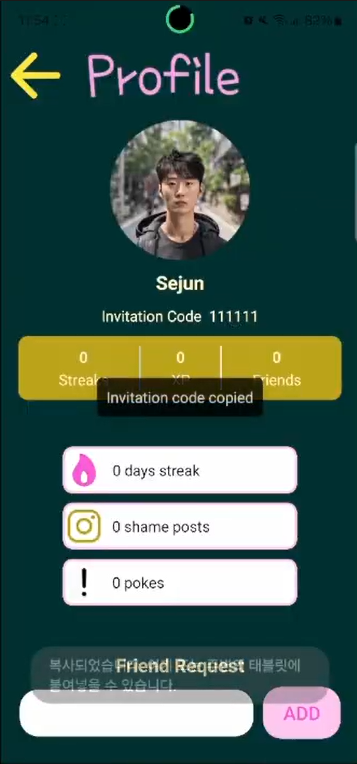
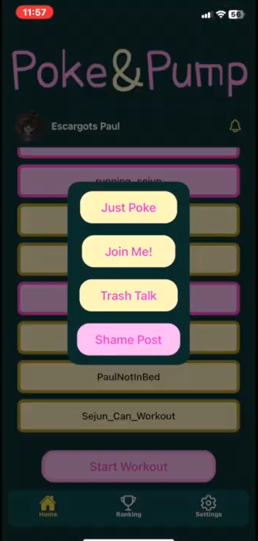
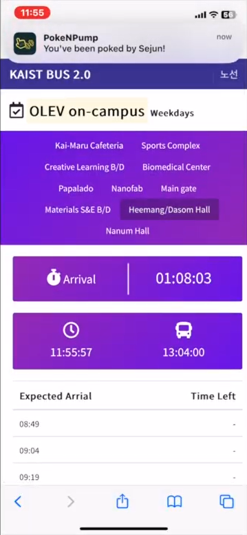
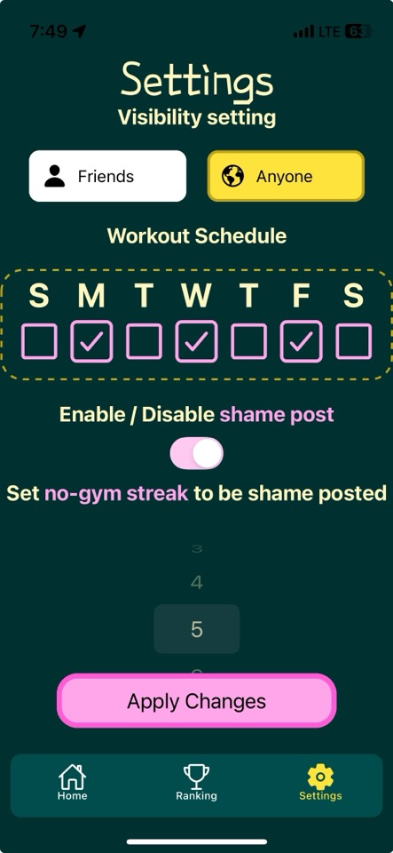
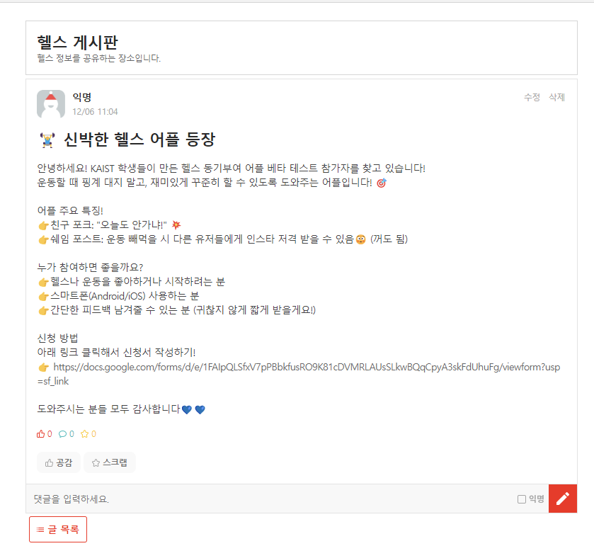
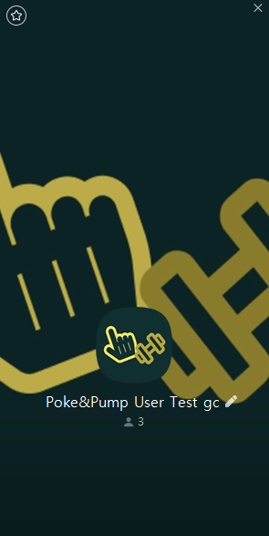

# DP5

## Representative screenshot

Provide users with options on social interactions

Safe friend system

Motivating other users with 3 types of predefined poke messages and shame posting 

Receving poke message while doing other things

Connetion to instagram for better accessibility

Changing social interaction options and workout schedule

## Quality Arguments

Poke&Pump addresses the challenge of gym motivation through real-world social interactions together with an intuitive design and gamification features. This service stands out by combining fun, accountability, and competition that keeps users engaged.

### Social Interactions

Unlike existing gym apps, Poke&Pump connects users to their real-world friends. 

The ‘poke’ feature is simple but highly effective. Users receive push notifications when poked by others, reminding them to attend the gym. Half of the respondents of our survey picked this as the most useful and enjoyable feature. One user described that being poked actually motivated to attend the gym because the action is made by real people, even friends, instead of an automatic messaged produced by bots.

Additionally, ‘shame posting’ feature leverages social visibility and peer pressure in a playful yet impactful manner. A tester described this feature as ‘a creative an original way of networking’. The other users replied shame posting helped keep motivated for workouts in the long term.

By making gym attendance a shared social experience, the interface fosters engagement and strengthens commitment. There were users who replied that they were motivated because there gym status is visible to their friends.

### Gamification with Ranking System

Weekly ranking introduces a competitive element based on XP earned not only by attending the gym, but also motivating others. The system is designed to encourage users poke and shame-post others as many as possible, since they can only earn limited amount of XP from attendance.

### Clean and Usable Interface

The interface is streamlined, with clear navigation for core features like poking, shame posting and checking the ranking. An user replied that this service was ‘quick, easy and very intuitive to use’. It only takes a single click to access poking and shame posting interface after launching the app.

## Deployment Summary

The deployment went pretty smoothly, it was easy to make people test our solution by uploading a new APK and allowing them to simply download and install it. However, we were limited by the strictness of the iOS ecosystem, it was difficult to make people install the app, since we had to register them and make them accept two invitations sent by email. We think it discourages a lot of iOS users. 

But still, we managed to attract a total of 24 users. To reach all these users, we mostly used SNS, such as the KAIST Everytime Gym Board and Instagram stories. 

Then, test users were redirected to a Google Form, allowing them to download the APK or register for the iOS app by sending us an email. But most importantly, the form was our feedback tool, allowing users to fill predefined fields about their experience using the app. We also created a KakaoTalk group chat to provide support for users. 

At the end of the “test phase” we fount out that for 24 users, 

- **141 pokes** have been sent
- **20 posts** have been shared on Instagram to ashamed people
- **23 friends request** have been sent

](./images/googleform.png)

[https://docs.google.com/forms/d/e/1FAIpQLSfxV7pPBbkfusRO9K81cDVMRLAUsSLkwBQqCpyA3skFdUhuFg/viewform?usp=sf_link](https://docs.google.com/forms/d/e/1FAIpQLSfxV7pPBbkfusRO9K81cDVMRLAUsSLkwBQqCpyA3skFdUhuFg/viewform?usp=sf_link)

Regarding the efficiency of the app for test users, more than **60%** replied that the app helped them to attend the gym. Among the feedbacks we received, two features of our solution were highlighted : 

- Being poked by real people instead of bots/programs is more motivating
- Shame posting actually helped people to keep attending the gym

## Discussion

### **Predefined Messages for Safe Communication**

To safeguard against inappropriate interactions and trolling, we've implemented a system of predefined messages. This ensures that all communications within the app are respectful and constructive, maintaining a positive environment for all users.

### **Privacy Controls**

Users have the option to control their visibility within the app. Our robust friend list management uses invitation codes and a system requiring approval for connections, ensuring that relationships within the app are consensual and manageable. Additionally, the option for easy removal of friends ensures that users maintain control over their interactions and privacy.

### **Incentives for Participation**

The app introduces a gamified environment where users earn experience points (XP) by attending the gym and motivating others through features like "poke" and "shame-post." This system incentivizes consistent participation and engagement by rewarding users not only for their physical activity but also for their role in motivating their community. We especially encouraged users to influence other users with unlimited rewards on social interactions, while they can only earn fixed amount of XP by simply attending the gym. 

### **Ethics and Community Building**

We are committed to fostering a supportive community. The poke feature is designed not just for fun but as a means to encourage mutual motivation and accountability. By enabling users to easily engage with and support each other, we aim to cultivate a space where inspiration and community spirit thrive, reflecting our ethical commitment to positive and supportive interactions.

### Quality Control

All the pokes were saved in the form of poke document in MongoDB. We monitored types and number of creation to ensure fair usage and prevent exploitation. For instance, we identified the misuse of repetitive shame posting to boost ranking. We also limited the number of pokes from each users by day to prevent one user creating too much pokes and destroy the weekly ranking. 

### Using ‘Shaming’

Shaming was implemented in our app as a motivational tool, proving highly effective in boosting gym attendance. However, to prevent any negative experiences or emotional distress, we carefully  designed the shame posting feature with strict limitations. Users have full control over their engagement with this feature; they not only opt in but also define their own thresholds for shame posting, by setting a specific "no-gym streak" that triggers a post. This ensures users are prepared and consenting to the potential consequences, maintaining a supportive and respectful community atmosphere.

### Peer Pressure

A lot of features of our solution are related to the Peer Pressure concept. First of all, the poke system establishes pressure since users can poke specific other users. Secondly, shame posting involves way more pressure (this is why users can choose to be shame posted or not) because it means the information about this specific user not attending the gym since a certain amount of time is shared with everyone on the SNSs. 

## Individual Reflection

### Paul Guerre

I collaborated with Yeongung Kim to develop the client side of our application using the Expo framework. My main responsibilities included integrating server API responses into the UI components, ensuring that data fetched from the server was accurately displayed and updated in real-time. Additionally, I worked on enhancing the app’s navigation flow and optimizing state management for a seamless user experience.

Beyond the development challenges, finding test users was particularly difficult. While many people expressed interest, most didn’t follow through, which was especially problematic on iOS since we had to send them invitations twice. Thankfully, by leveraging social networks and gym platforms, we managed to overcome these initial hurdles and gather sufficient feedback to move forward.

This project gave me a solid foundation in Expo and React Native development, particularly with API integration and managing app state. One of the biggest lessons I learned was how to effectively collaborate with the server team to quickly identify and resolve issues. Dealing with user testing was also a completely new experience for me and added a layer of complexity I hadn’t encountered before in computer science, making the project both challenging and rewarding**.**

### Sejun Jung

I was in charge of making the server side of our app. This included building the server, setting up databases with MongoDB, and adding parts where the app talks to the server (API endpoints). At first, I worked on the server by myself and used Git to share updates. Later on, I put the server online using AWS so everyone in our team could use it without problems. During AWS setup, we also faced connection issues created by attack on server. After a security breach caused by reduced security settings, I enforced strict AWS access rules to ensure safe and stable team connectivity. I also helped fix some issues with push notifications and app crashes during our app's release through APK and TestFlight.

Our team was really independent and focused on making an app that we all wanted. We used Discord for our meetings, which was new to us but made discussions more casual and friendly. This was probably the least stressful project I've worked on at school, even though we sometimes missed our deadlines. In the end, we were all happy with the app we created.

From this project, I learned a lot about managing servers, using Git for sharing changes, and setting up databases. I got better at solving technical problems by looking at the server logs to find out what went wrong. This experience taught me how to handle server problems more effectively, which will be really useful for my future projects. This project was a great learning experience and helped me see how important teamwork and good communication are when working together on something big.

### Yeongung Kim

  I took parts in implementing the client mobile application. Specifically, 

- Managed data transferred between components. I focused on reflecting data updates from both server and user in real time, which includes pokee-list, user stats displayed on the profile page, and options on the settings page.
- Implemented components that handles user inputs. Namely, dialog for poking, selectors for updating visibility, shame-post settings, and workout schedule.
- Took charge of design integrity. I proposed design theme trying to provide funky mood together with intuitive  and streamlined interfaces.
- Handled general UI features expected in a mobile application such as Toast message that gives users instant feedback upon their actions, keyboard-aware user inputs, and layouts that keeps components intact from scrolling and hardware features like notches. I tried to help users not to feel discomforts using our service.
- Built and deployed the application iOS. I managed platform-specific configurations to use enable notification and distribution via Testflight.

 What made it hard to progress as a team was that in many times, each members could contribute in different period of time. It would have been more efficient if we could develop and discuss about our service together. Hence, we utilized collaboration tools that helps handling asynchronous communication. We implemented the application based on shared unit of works (github issues and project), kept up versions by making frequent pull request (code reviews) and monitored progression on discord channels. On next team projects, I might try to have more frequent synchronous communications. Even though there are strategies to cooperate with remote teammates working individually, it requires significant amount of additional communication costs.

 In this project, I learned that having strict rules on managing shared repository could be beneficial despite requires extra attention, especially on handling critical data (keys, accounts, etc) and resolving conflicts from different branches of work.