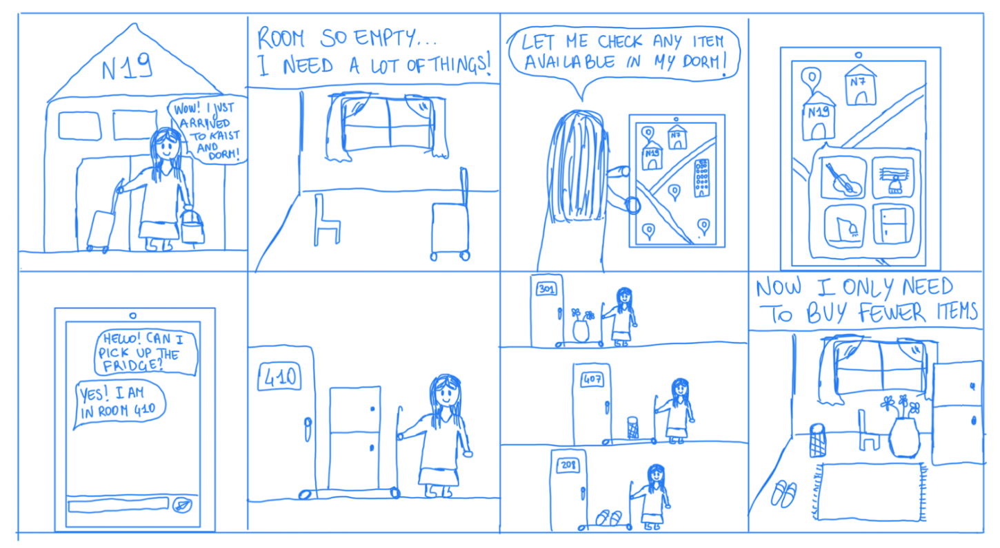

# Pizza.js DPM 1 Report

## Problem Statement
Students in dormitories struggle to find handed-out or sharable items, leading to unnecessary purchases.

## Problem Background
From our experiences, freshmen and exchange students often face financial pressure when buying new items for campus, while many students moving out throw away perfectly good, reusable items. Although donation boxes exist, they are scattered and lack visibility, and students often struggle to find someone to exchange items with, leading to unnecessary purchases. Similarly, other universities have addressed this issue by encouraging students to use messaging apps to exchange second-hand items, creating a more affordable campus experience [1]. Some universities also organize offline exchange events, though these happen less than twice a year [2]. This problem is important because it reduces resource waste by reusing otherwise discarded items and financial pressure on students by promoting sharing among students, thereby fostering sustainability and easing mental stress associated with unnecessary purchases.

## Motivation
This is a social computing problem because the core of our solution involves students sharing information through a custom-designed online platform, creating a demand-supply cycle. Simply designating a physical location for donations would not work as effectively—it would be less organized, require more space, and limit visibility. Also, offline communication reaches a smaller group, making it harder for students to find what they need when they need it. By leveraging a digital platform that connects students, we can reach more students in a more efficient and structured way.

## HMW Questions
- HMW make the search for donated items more organized and visible?
- HMW encourage a culture of sharing and reusing items among students on campus?
- HMW eliminate the need for students to physically check donation spots?
- HMW ensure students are informed in advance about available items?
- HMW connect students seeking items with students giving away items?
- HMW reduce the number of items thrown away by students?
- HMW make the process of sharing items more fun or rewarding?
- HMW inform other students of the object needed by other students?
- HMW ensure that donated items meet certain quality standards?
- HMW help students feel more comfortable taking second-hand items?

## Selected HMW Questions
- HMW make the search for donation items more organized and visible?
- HMW encourage a culture of sharing and reusing items among students on campus?
- HMW reduce the number of items thrown away by students?

## Solution Ideas for HMW Questions

### HMW make the search for donated items more organized and visible?
- A smart donation box where items are catalogued automatically once donated
- Real-time map showing current donated items on campus
- An online platform where students can post and tag donated items and check availability
- Regular in-person swap meets where students can give away items they no longer need
- A notification system that sends alerts to students when a new item is placed in a donation box by using sensors

### HMW encourage a culture of sharing and reusing items among students on campus?
- Create a virtual currency which allows students to receive and give away items
- Launch social media challenges that encourage students to share their secondhand finds or sustainable practices
- Make students on campus sign a sustainability pledge committing to reducing waste and sharing resources
- Gamify the sharing experience by introducing quests and digital badges for active users
- Sustainable move-in kits for new freshmen students featuring items that have been donated
- Create virtual groups where students with the same interests (e.g. cooking, painting…) can share their items which are specific to their hobby

### HMW reduce the number of items thrown away by students?
- Create designated drop-off points on campus
- Seasonal virtual donation campaigns with delivery between dorms
- Educational workshops teaching students how to repurpose or upcycle items they no longer need
- Create a dashboard where students can report items they’re planning to discard, offering others a chance to claim the item before it’s thrown away
- Students can offer repair services (e.g., sewing, electronics fixes) to extend the lifespan of items

## Selected Solution Ideas
- Real-time map showing current donated items on campus
- An online platform where students can post and tag donated items and check availability
- Gamify the sharing experience by introducing quests and digital badges for active users

## Storyboards
Real-time map showing current donated items on campus

An online platform where students can post and tag donated items and check availability

Gamify the sharing experience by introducing quests and digital badges for active users

## References
[1] 佚名. "When second-hand comes first". China Daily. May 4, 2024. https://www.chinadaily.com.cn/a/202405/04/WS66357083a31082fc043c528e.html  
[2] Foley, Jessica. "Students Invited to Donate Second-Hand Items on Queen's Campus." Kingstonist, 25 Apr. 2024. https://www.kingstonist.com/news/students-invited-to-donate-second-hand-items-on-queens-campus/