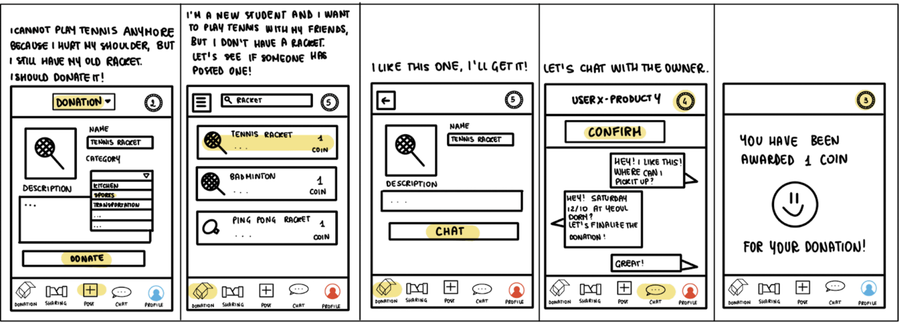
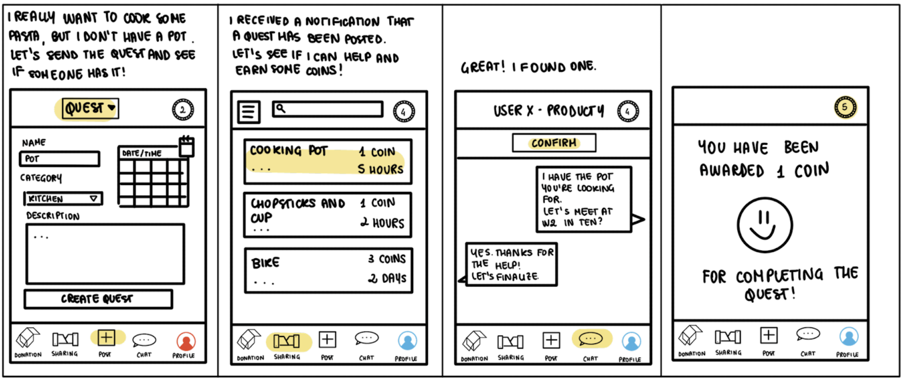
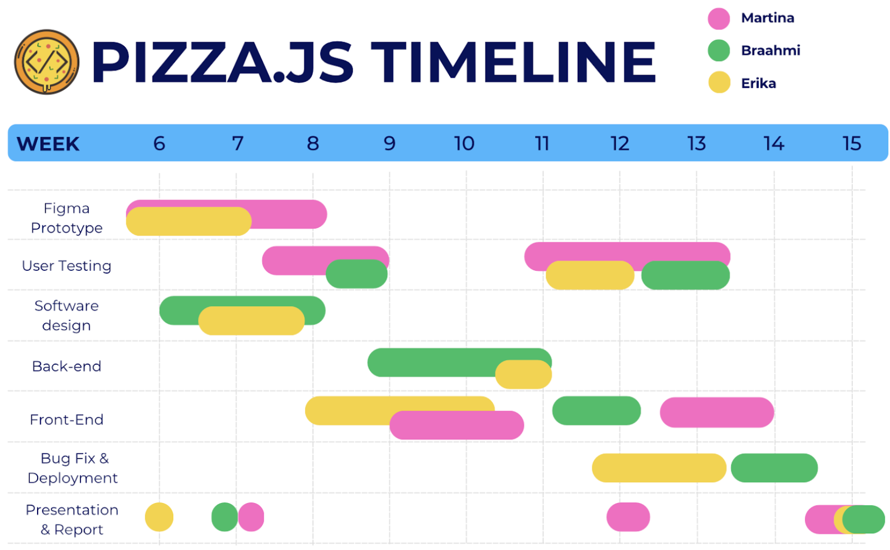

# Pizza.js DPM 2 Report

## Problem Statement
Students in dormitories need an efficient system for finding handed-out or sharable items like kitchenware, especially during move-in periods, as they often struggle to find available objects, leading to unnecessary purchases.

## Solution
Our platform is designed for students living in dormitories. Students frequently need access to essential items, whether for temporary use or longer periods, and our platform simplifies the process of finding and sharing these resources.

The platform works through a community-driven system that allows users to share, donate, and receive items based on their activity level. By donating or sharing, students earn coins, which can then be used to access other items listed by fellow students. This system encourages ongoing participation, ensuring a steady flow of available items and rewarding users for their contributions. This solution is feasible because it leverages a proven community-driven model and existing technology, ensuring efficient item exchange through an organized, user-friendly platform tailored specifically for campus environments.

Beyond convenience, our platform offers significant value by helping students save money and reducing the need for unnecessary purchases through seamless exchanges. It also promotes environmental sustainability by encouraging reuse and fostering a sense of community, bringing students together through shared resources and collaborative efforts.

## Storyboards
- "Giving Away: posting and picking up an item" 

- "Borrowing: requesting and arranging a loan"

## Core Tasks
### Core Task 1: Post an item up for donation in a dashboard
Users upload an item by providing an item name, description, and images, and selecting category tags like "kitchen," "sports," etc. This is core to the solution because it provides users with a centralized space to post products they no longer need, facilitating the spirit of sharing and sustainability. The platform enables this by allowing users to easily post items, automatically assigning a coin value proportional to its market value to the item, and denoting the amount of coins a user would need to get the item.

### Core Task 2: Find an item you need using the category tags
Users search for needed items using category tags like "kitchen," "sports," etc., to quickly filter listings based on their requirements. This task is crucial as it helps users easily find required items, making the process efficient and user-friendly. The platform enables this through a well-organized search function that filters items by tags selected by the donators at the item posting stage and allows users to contact item owners through an integrated chat feature.

### Core Task 3: Create and answer sharing quests
Users can create a borrowing request (sharing quest) specifying the item, duration, and other details, and other users can fulfill the request by lending their items. This task is key because it allows students to share items on a temporary basis, increasing resource availability and fostering a collaborative community. The platform supports this through a quest list where users can track borrowing requests along with the coins offered for completing them, engage with users, and earn coins, which can be used to later get other shared products, ensuring a dynamic flow of shared goods.

## Competitive Analysis
For our competitive analysis, we focused on alternatives currently used on campus by students, which are either online or offline.

**Donation Boxes** offer a convenient and familiar solution for students to drop off items in physical locations. However, their major limitation is the lack of visibility and real-time organization. Donation boxes are often scattered across campus, and there’s no centralized system to inform students of available items, which makes it difficult for students to know what’s currently accessible. In comparison, our proposed platform provides real-time visibility and centralized virtual access to all donated items, enabling students to see what’s available instantly without physically visiting the locations. This increases the ease and efficiency of finding needed items.

**Online Marketplaces** like Facebook, ARA, and Carrot have a wide reach and are platforms familiar to many users. However, these platforms aren’t campus-specific, which can lead to irrelevant listings, paid items, or difficulty in locating free goods. Additionally, it is often challenging to filter results to see items only available on campus. Our solution focuses on a campus-specific community, ensuring that all listings are relevant to students and include free items, making it easier for students to find what they need within their immediate environment.

**Discord Group Chats** are easy to join and create a community-based approach to sharing, but they are often informal, and posts can easily get lost in the chat, making it hard to search for specific items or check availability. Our platform addresses these limitations by offering a structured system with searchable and organized listings, ensuring students can efficiently browse available items and find what they need without sifting through a cluttered chat history.

## Timeline and Responsibilities
- **Figma Prototype (Weeks 6-8):** Create initial wireframes and design the app’s interface for both sharing and donating items.
- **User Testing (Twice, Weeks 7-9 and Week 10-13):** Conduct an initial testing followed by a second round of user testing to gather general feedback and improve the design.
- **Software Design (Weeks 7-11):** Plan the app's architecture, including database and backend setup.
- **Backend Development (Weeks 9-11):** Build the backend for handling user data and item listings.
- **Frontend Development (Weeks 9-14):** Develop and connect the frontend with the backend for a seamless user experience.
- **Bug Fixes & Deployment (Weeks 12-14):** Test, fix bugs, and prepare the app for launch.
- **Presentation & Report (Weeks 14-15):** Finalize the report and presentation for submission.

For the detailed timeline, we created a Gantt Chart where we divided our responsabilities:
