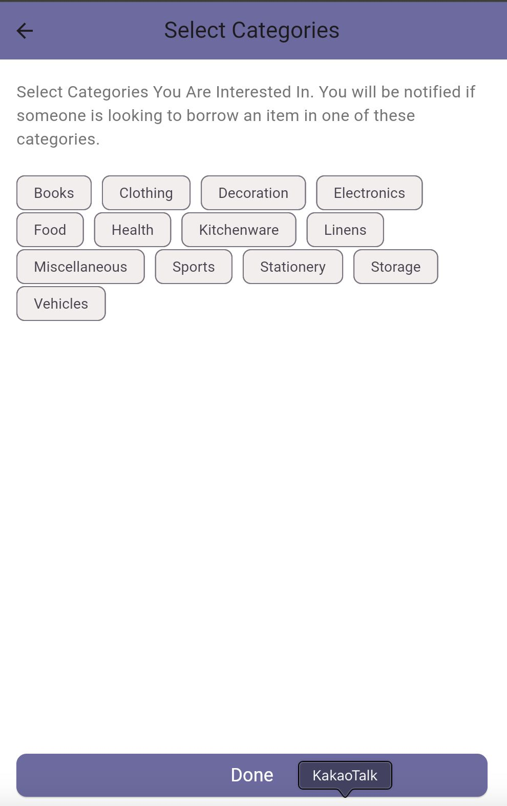
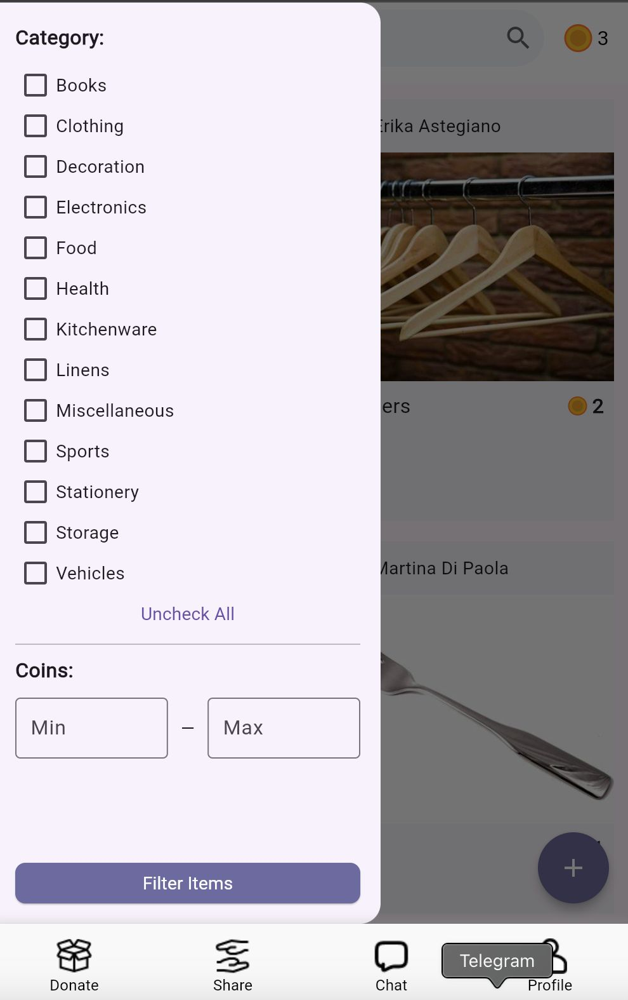
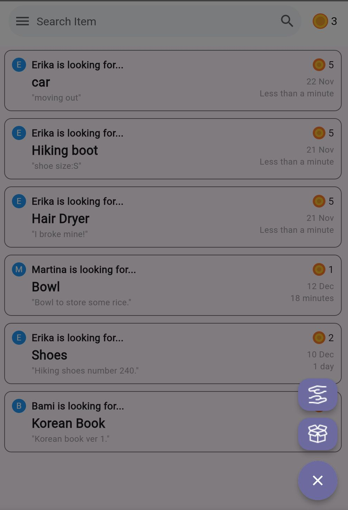
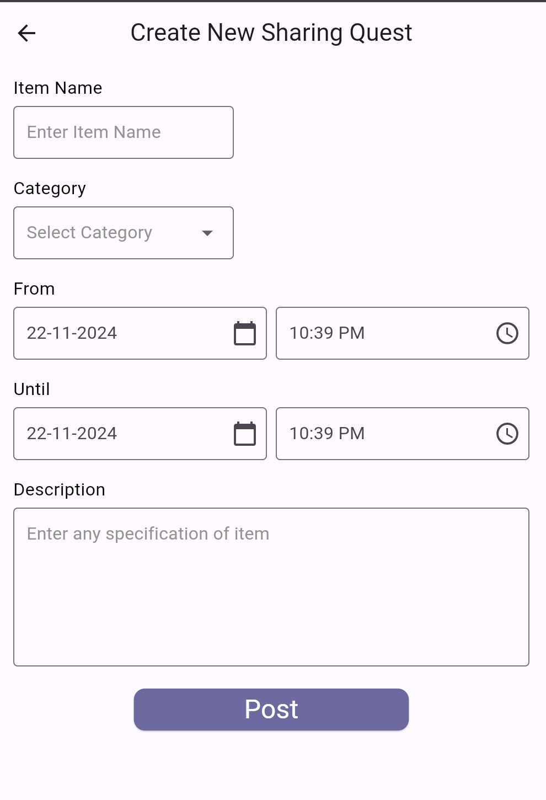
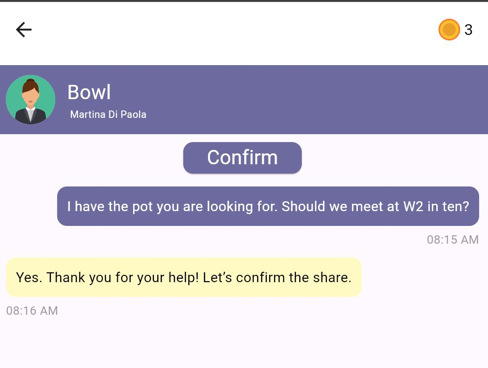

# DPM4: Pizza.js

# **Project Summary**

Students in dormitories need an efficient system for finding handed-out or sharable items like kitchenware, especially during move-in periods, as they often struggle to find available objects, leading to unnecessary purchases.

Our platform addresses this issue with a community-driven system where users earn coins by participating to the exchanges. These coins can be used to access other shared items, promoting cost savings and fostering a sense of community.

Our approach simplifies the process of sharing and donating by providing a user-friendly mobile application. The app allows users to create posts, browse available items, and directly contact item owners, making the experience organized and efficient.

# **Instructions**

When the prototype launches, the first page shown will be the login and signup screen.

For the signup process, users will first enter their personal information. They will then select categories of products they already own to guarantee they receive only relevant notifications. Note:  the notification feature is still under development.



We recommend logging in with the given credentials instead of using a new user account, as this will give you access to existing chats. Please, enter the following credentials to log in:

> student_id: 20246475
> 
> 
> Password: try12345
> 

Once logged in, four pages will be available through the Navbar: Donation, Share, Chat, and Profile.

In both the Donation and Share sections,  the list of available products is displayed. To filter these products, click the menu button in the top-left corner to open the filtering options. You can select your preferred categories and then press 'Filter items' to display the relevant products.

Additionally, you can set a minimum and maximum coin amount to filter items based on their value. Currently, these two filtering options work independently, but we plan to enable combined filtering in a future update.



Clicking on a product post will open a page with more detailed description. This page includes information about both the product and its owner.

Pressing the chat button will automatically create a new chat with the donor, which will then appear in the Chat section.

On the Share page, you can respond to a sharing request by clicking on a post or create your own request by pressing the plus button.

When you click the plus button, two options will appear. Select 'Share' to open the posting page of a sharing quest, where you can enter all the necessary information. For security reasons, the coin value is not entered by the user but is calculated and added automatically by the app.






Returning to the Share page, you can respond to a sharing request, such as the 'Bowl' post by Martina. Once you click the post, you can find the item details. The 'Chat' button in this page directs the user to the corresponding chat. You can send messages to the donor by typing the message and pressing the 'Arrow' button. Here, you will find a 'Confirm' button, which finalizes the agreement. Once the confirmation is done, the user can share their product. Once they receive the product back, they can click the 'Returned' button to confirm the return. Clicking this will make a pop-up appears that will ask you to rate the borrower. 



Closing the pop-up will redirect you to the open chat. The button at the top will be greyed out, indicating that the borrow quest is closed.

Finally, the Profile page displays the user's information. An important feature is the one that allows the users to edit the list of categories they selected during signup.

Another notable feature is the option to mark the user as a graduate. Once selected, this enables the user to transfer their remaining coins to another user of their choice. This feature is currently under development.

## Considerations

Thanks to the user study conducted before coding the application, we gained valuable insights into the usability of our interface. We observed how users interacted with filters, which led us to decide on leaving all filters unchecked by default.

Additionally, we addded the user's location information based on feedback received during the interviews.

We decided for a local SQLite database during development to avoid the restrictions of an online solution like Firebase, like daily interaction limits. This implies that the changes are only visible locally, so for the final version of the app, we plan to transition to an online database to support scalability and real-world usage.

The login system is currently a simplified version, but both the database and backend code are prepared for an upgrade to a more secure structure using libraries like Passport and LocalStrategy. We plan to make this change for the final version of the app.

# **URL of the prototype**

[https://github.com/marticodes/DropApp/tree/main](https://github.com/marticodes/DropApp/tree/main) 

The provided URL links to the GitHub project, as the app can be launched through GitHub code and the web simulator.

### Github

1. Open the Github page of the project and copy the link. 
    
    
    
2. Create a new folder into your computer. Open the folder, press the right button of your mouse and press “Open Git Bash”.
    
    
    
3. In the terminal write the following:

```jsx
git clone repository_url
```

If git is not installed in your computer, you can download the zipped folder directly from the Github page.

## Node

1. Install Node [1] following the instructions on the website.
2. To check if Node has been correctly installed, type this command into the terminal of your pc:

```jsx
node -v
```

## Npm

1. npm is installed automatically when you download Node, but in case of errors you can type:

```jsx
Set-ExecutionPolicy Unrestricted
```

### VSCode

1. Open a project and open the “Extensions” section of VScode.
    
    
    
2. Type “Flutter”, open the first result and install it.
    
    
    

3. VSCode will display an alert about the missing SDK. Click 'Download.' ATTENTION: Be sure to remember the folder where you are downloading Flutter. It will be useful for the next step.
    
    
    
4. Open the System Variable and add the path of the flutter/bin folder to the Path section.
    
    
    
5. Open the VSCode terminal and execute the following commands:

```jsx
cd backend
rm -rf node_modules
npm install
npm rebuild sqlite3
node index.mjs
```

1. Open a second terminal in VSCode and execute the following commands:

```jsx
cd frontend
flutter run -d chrome --web-browser-flag "--disable-web-security"
```

## References

[1]: [https://nodejs.org/en/download/package-manager](https://nodejs.org/en/download/package-manager)

# Libraries and Frameworks

Libraries used for similarity search within products file:

```jsx
import { readFileSync } from 'fs';
import pkg from 'natural';
const { PorterStemmer } = pkg; 
import { compareTwoStrings } from 'string-similarity'; 
```

Libraries used respectively for APIs management, Cross Origin interaction, Session and Login:

```jsx
import express from 'express';
import morgan from 'morgan';
import { check, validationResult } from 'express-validator';
import cors from 'cors';

/** Authentication-related imports **/
import passport from 'passport';
import LocalStrategy from 'passport-local';
import crypto from "crypto";

/** Creating the session */
import session from 'express-session';
```

The login and sign-up form in the frontend are also created following layouts available on the internet and the adapted to our application.

Libraries used respectively for APIs dart conversion, page structure and dates handling:

```dart
import 'dart:convert';
import 'package:http/http.dart' as http;

import 'package:flutter/material.dart';
import 'package:intl/intl.dart';
```

AI chatbots, like ChatGPT and Copilot,  have been used to handle debugging of the code and the generation of the products file.

# **Individual Reflections**

## Martina (Frontend)

Me and Erika led the prototype design phase, bringing different solutions for the app’s features, such as the coin value assignment, and selecting the ones that adapted best to our needs.

Coding wise, I focused primarily on implementing the frontend, following our Figma prototype to ensure the design aligned with our vision for the app. Specifically, I implemented the Filter Menu, Search Bar, Login/Signup, Donation, and Profile sections.

For the login and signup pages, I followed popular social media layouts to create a user-friendly experience.

The most challenging part of the project was connecting the login and signup features to the backend. This was particularly complex due to the numerous variables that needed to be handled. Additionally, this was my first time working with Flutter, which has a challenging syntax. However, my teammates were incredibly supportive, helping me become familiar with various Flutter packages and making it easier for me to learn a new framework.

## Bami (Frontend)

I led the user study necessary to finalize the prototype design, interviewing seven participants from diverse backgrounds to identify usability issues in our interface.

My contributions to the code focused on the Navbar, Share, Chat, and API integration in the frontend.

The most challenging aspect for me was working on the messages pages, where I had to manage multiple models and API requests within a single page. Handling nullable values in the models and ensuring smooth data transfer across pages added to the complexity. However, once I implemented the solution for one page, the process became more manageable for the others. My teammates were incredibly supportive throughout, especially in helping me navigate API integration and maintain consistent data flow between frontend components.

Integrating the API into the frontend turned out to be my most significant learning experience in this project. It provided me both an understanding of a new coding language and knowledge about how data flows between the client and server.

## Erika (Backend)

Martina and I handled the prototype design before starting the actual coding, focusing on designing the features and specifications.

My coding contributions involved working on the DAO, database, APIs, and models in the backend.

The most challenging aspect for me was working on the search function related to the product file, as handling the concept of word similarity proved quite difficult. Ensuring that the search function accurately identified related products required implementing logic for both exact matching and similarity search. My teammates were very supportive, especially in helping to connect the APIs to the frontend, which ensured smooth integration and consistent data flow across the application.

Both individually and as a group, we learned the importance of time management and communication. Since the backend APIs needed to be developed for the frontend to function, but the frontend was also necessary to fully test the APIs, we realized that constant updates and internal deadlines are essential for smooth collaboration.