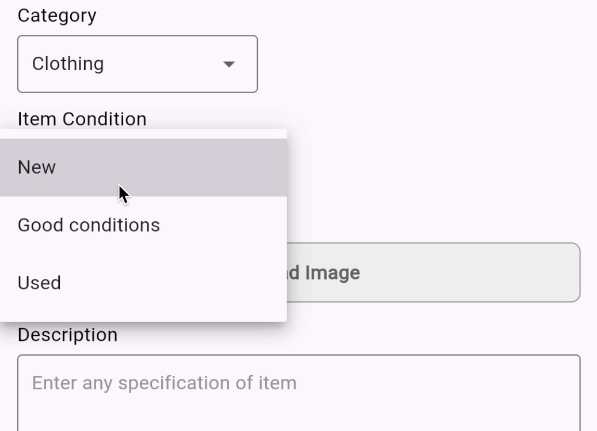
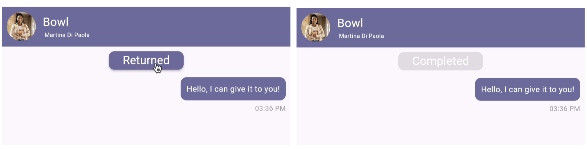
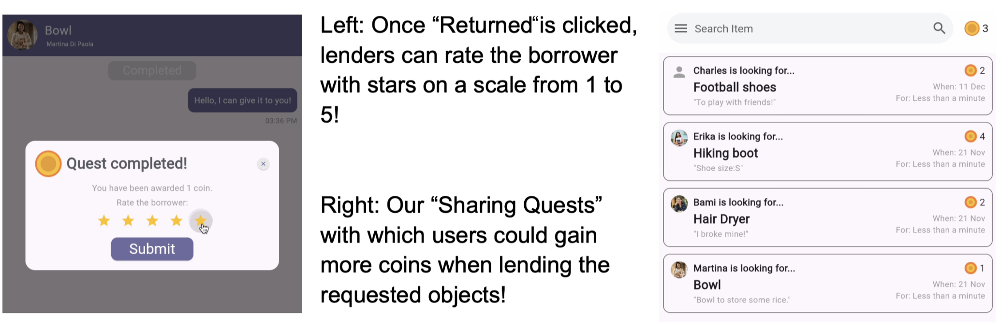
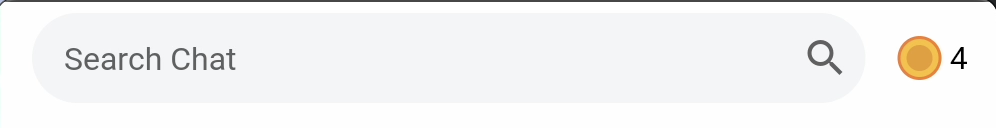
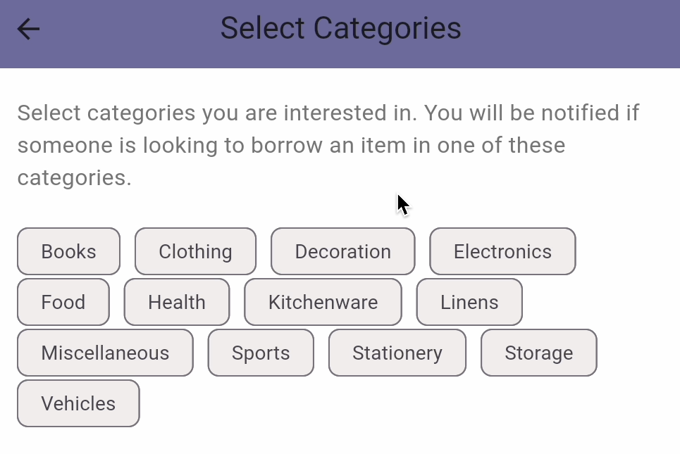
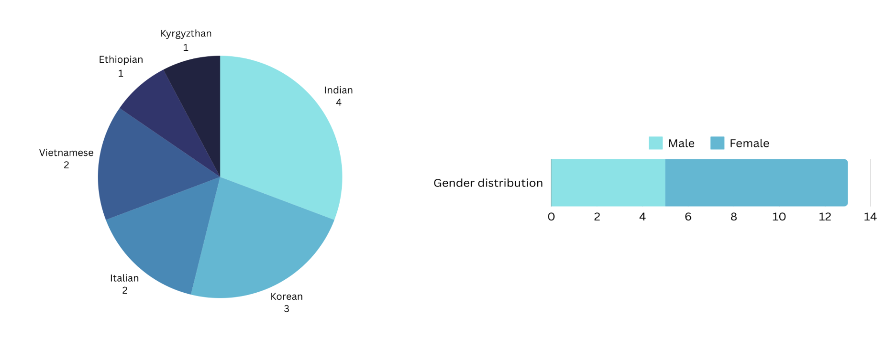

# Pizza.js Report - DP5

## Quality arguments

Our interface addresses a real-world problem, facilitating the sharing of resources among dormitory students, through practical design and innovative features.

### **User-Friendly Features**

The application offers intuitive **filtering** mechanisms, allowing users to search for items by category or coin value efficiently. Floating **action buttons** minimize visual clutter while maintaining quick access to key functions. Input features such as **placeholder text** and drop down lists streamline the process of creating posts, reducing errors and enhancing usability. 

Visual cues, like a “Completed”  button that changes color, ensure users can easily track their interactions, adding clarity to the borrowing and returning process.

### **Social Interaction**

Integrated chat and confirmation features promote clear communication and foster trust among users. The **feedback system** is studied to increase accountability within the platform. After an item is returned, a pop-up enables users to rate their interaction partner. These ratings are displayed on sharing quests and donation posts, providing transparency and helping users make informed decisions about who they engage with.

The app also introduces a ***coin economy***  system to motivate participation, promoting sustainability and a sense of community among users.

### **Functional Design**

The interface prioritizes clarity and **ease of use**. Pages are logically structured, ensuring a cohesive user experience. Key information, like the user’s **coin balance**, is always visible, enabling users to make decisions quickly and effectively.

### Customizable Interactions

During the sign-up process, users can **select categories** they are interested in sharing, tailoring their experience to match their preferences. These selections are fully customizable on the profile page, allowing for flexibility as interests evolve. The app plans to notify users about sharing quests relevant to their chosen categories, ensuring a personalized engagement.

## Deployment summary

Our user study helped us understand the general user perception of our application, what specific features they loved, what errors we could fix, and how we could improve our app for future iterations.

The following diagrams showcase the characteristics of our participants:

The user study proceeded in three steps :

During the study, users expressed enthusiasm for using the app and narrated anecdotal experiences when this app could have potentially helped them.

Users ranked our application a perfect 5.0 for efficiency reflecting the app’s success in solving the problem of finding second-hand or shared items. Usability’s 4.5 rating indicates that while core features work well, minor adjustments can further enhance the experience. Learnability’s 4.0 shows room for improvement, particularly in helping users quickly grasp all functionalities.

### Key Findings

Strengths:

- Users praised the easy sign-up process and the coin-based economy, which fostered a sense of community by encouraging sharing and donation activities.
- Design elements like filters for specific products, coin ranges, received positive feedback for usability and differentiated image styles for chats on donations vs sharing products was appreciated for ease of identification in a larger list

Weaknesses Mitigated through Updates and Future Work:

- Empty chat screens when buffering disrupted the user experience, so we added loading screens.
- Current pricing system uses a database generated from chatgpt which has pricing inconsistencies (e.g., chargers priced lower than socks identified during user study), which highlighted the need for an in-depth refine of the database.
- Users requested features like tutorial dialogue boxes to increase learnability of system
- Users suggested that providing an option for written reviews will help provide more context towards user behaviour in interactions.

**Future Studies:**

Further user studies should focus on understanding user retention and see user responses in potential scam situations.

## Discussion

Drop is a mobile-based multi-modal group platform for finding handed-out or sharable items.  

**Intrinsic Motivation**

Drop works based on the fact that its users, namely university students, are intrinsically motivated by their need to find items at a cheap price to ensure their financial stability. Furthermore, students, especially those on exchange, are often in need of finding items temporarily, which is also supported through the item sharing feature of our app. Both of this has also been further tested and verified by our initial user study with 7 people and deployment user study with 13 people.

**Extrinsic Motivation and Social Proof**

This, however, also means that the platform survives on the belief that users will actively contribute through donating or sharing items instead of just solely wanting their own quests to be satisfied. Our app is implemented in the way that in order to get items through donation or sharing, users need to have enough coins, determined in proportion to the value of the item. Users can only gain coins by either sharing or donating an item. This provides users with the extrinsic motivation needed to contribute actively to the Drop community. Social proof is a psychological and social phenomenon wherein people copy the actions of others in choosing how to behave in a given situation or space. In the context of our app, social proof ensures that seeing other people contribute actively to the app by listing items for donation and resolving sharing quests will encourage other users to follow in similar fashion.

**Reputation System and Accountability**

Establishing trust between users is essential for smooth item sharing. To facilitate this, we require users to sign up using their official names and a valid KAIST ID that matches their identity. However, we recognized that this alone might not be sufficient. Therefore, we implemented a reputation system where lenders can rate borrowers on a scale from 1 to 5, enabling users to build additional trust based on aggregated ratings. 

The system promotes accountability by linking user behaviour to their official identities. This connection ensures that users are more likely to act responsibly, knowing that their actions will affect their reputation and future interactions on the platform.

**Coin Assignment and Abuse Prevention**

Since our plaftorm is based on a “coin economy” system, avoiding misuse is fundamental. To promote fairness and prevent abuse of the features, we’ve chosen not to let users assign coin values to the objects they donate or share. Instead, our algorithm calculates coin values based on the product’s name, category, and condition. This approach fosters equity, ensuring all users’ contributions are valued consistently, and mitigates potential disputes or manipulation.

This decision falls within the principle of abuse prevention and mitigation (trust and safety). By providing a clear and unbiased valuation process, we aim to create a more trustworthy community for sharing and donating.

## Individual Reflection

**Erika**

For this project, I was responsible for the backend of the mobile application. This included not only coding the necessary functions but also establishing connections with external components. In the first prototype, I handled both the database and server locally, but for the final version, we decided to move online. Most of my work during the final period involved updating the queries to fit the new db and collaborating with my team to deploy the server.

One area where our team did well was building a support system. We assigned tasks based on our individual skills, and whenever someone faced a problem they couldn’t solve, we worked together to find a solution. However, one area where we struggled was integrating our works. Since we each worked on separate but related parts, a lot of issues came up when we tried to merge everything without losing changes. The most important teamwork skill I learned during this project is the value of constant communication and setting internal deadlines. This approach made problem-solving easier and kept everyone more satisfied with the process.

This project also helped me grow as a developer. It expanded my coding skills, since mobile app development was a completely new area for me. Deploying the final version of the app was also a new experience, since that’s not something that’s usually done in university-related projects.
Beyond technical skills, I also gained a better understanding of design. As engineers, it’s easier to find the "optimal solution”, but that doesn’t always mean it’s the "best solution" for the users. This was a valuable lesson that every developer should learn.

**Martina**

My primary focus was on the frontend, where I was responsible for implementing the donation feature, user management, and filtering and search functionalities. I also contributed to the backend, particularly during the deployment phase: I helped my team connect our application to an online database for real-time image storage. My familiarity with platforms like Render and Firebase allowed me to support the team the best.

Overall, I believe our team worked well together, and our collaboration improved significantly after midterm when we started conducting more in-person meetings. However, we still faced challenges when it came to making group decisions. Despite these difficulties, we managed to navigate through them successfully. For future projects, I would prefer working more collaboratively rather than individually. When building an application, merging different components early is essential, as it helps identify and resolve coding conflicts sooner. I found that coding together is not only more efficient but also more enjoyable.

This project was my first experience working with Flutter, and I’m glad to have gained practical experience developing a fully functional Android application. At first, I was a bit skeptical, as building an application can be quite complicated. However, by the end, even though the user interface might not look the best, we successfully implemented everything we had planned from the beginning, which felt like a victory for me. Probably the biggest satisfaction I got this semester was when I saw for the first time that chat was working between two phones, it felt like the biggest accomplishment. We had to consider some trade-offs and chose optimization over aesthetics, but for future projects, I would prefer to have one team member focus solely on design while assigning more people to backend development.

**Braahmi**

My primary responsibilities included front-end development and conducting user studies. I focused on designing and implementing the share and chat tabs, as well as enabling real-time messaging across different accounts. Additionally, I worked on updating coin values after object transfers, handling data transfer across multiple pages, and making API calls to integrate with the backend.

Overall, our team collaborated effectively. One highlight was our practice of coding together and celebrating milestones—especially when we resolved persistent bugs that had caused significant challenges. We also supported one another in finding solutions and alternative approaches when initial methods failed. However, merging our code was a recurring challenge. Since we worked on independent components that needed integration, merge conflicts were common. Regularly fetching updates from GitHub and ensuring we worked on the latest versions of the code helped mitigate this issue. Initially, we also faced difficulties in reaching consensus during discussions. Over time, by working closely together, our communication and decision-making improved significantly. For future projects, I would prioritize frequent communication with team members to align on implementation. Infitially, for our application, we coded front end and backend mostly independently. Because of this, we had to spent significant amount of time on integration. Communicating efficiently from the beginning would help minimize issues during the integration phase and improve overall efficiency.

This project marked my first experience building a fully functional application. Through it, I developed skills in Flutter, Dart, and API integration. I also gained valuable experience in application integration, and I now feel much more confident using GitHub. This experience strengthened my problem-solving, collaboration, and adaptability skills, which I will continue applying in future projects.