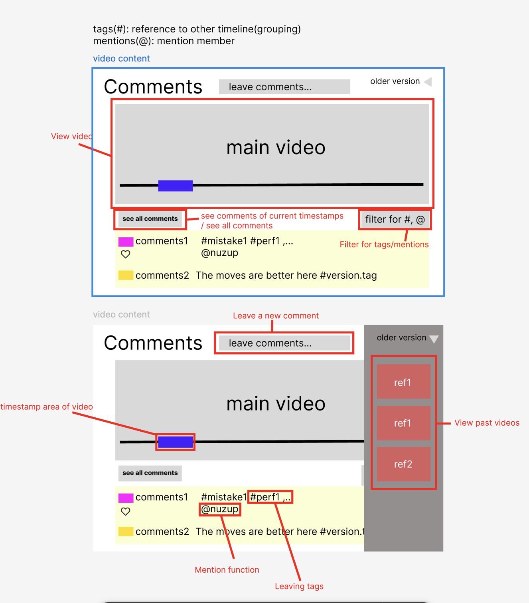
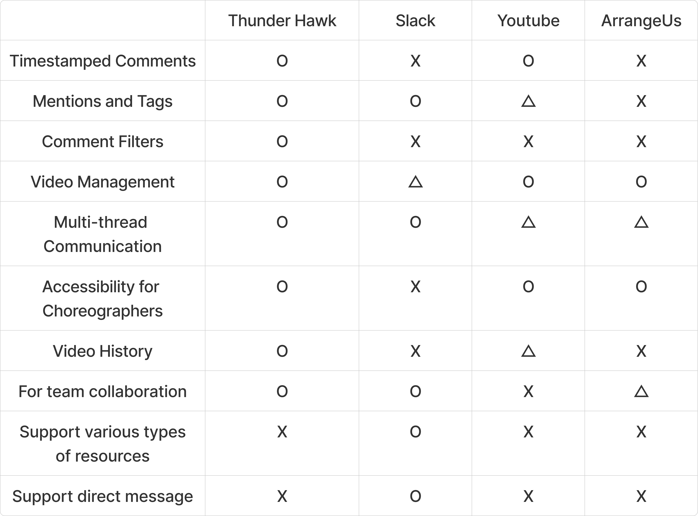
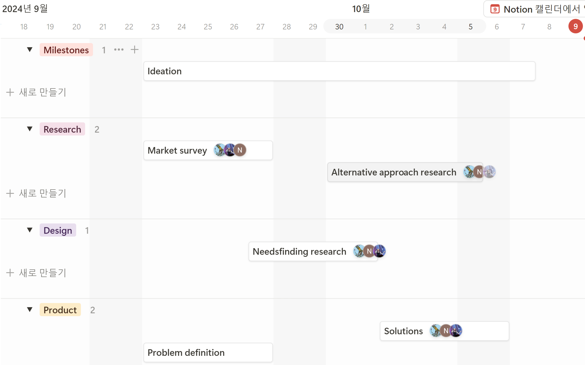
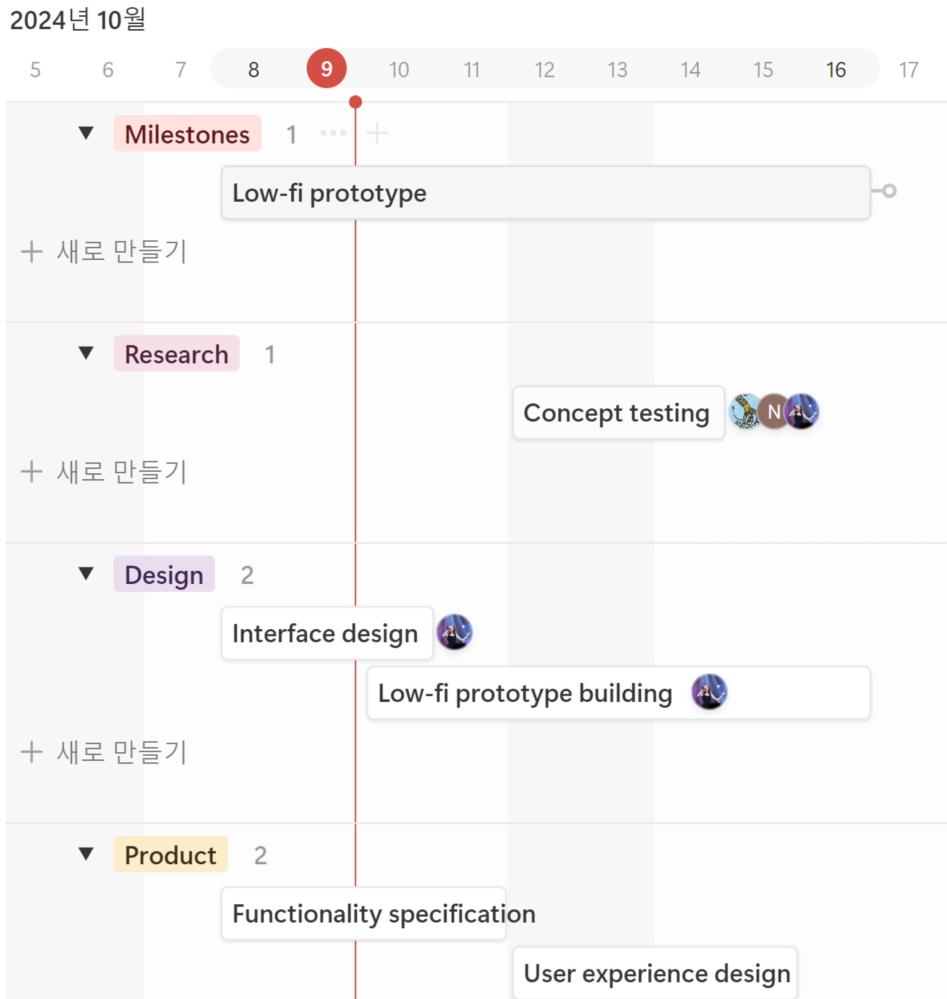
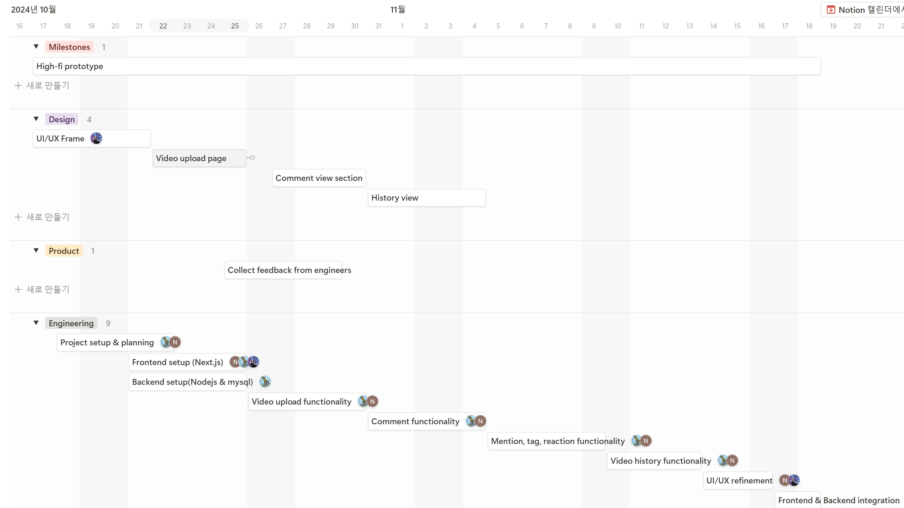
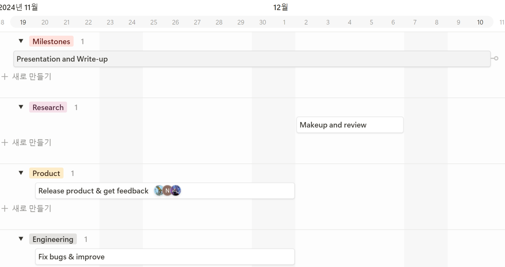

# Problem Statement

Collaboration is crucial in choreography, but since the methods of collaboration are **unstructured**, there is a lot of **inefficiency in communication** such as **misunderstandings between members** and **ambiguity in directions**.

# Solution

Our solution is to create an online collaboration platform that is tailor-made for choreographers and performers to improve communication during the creative process. During rehearsals, users can leave **timestamped reactions or comments** in video form through the platform; this gives instant feedback precisely on specific moments of the choreography. Comments can also be organized through the use of **tags and mentions** to structure and direct these to relevant members with reduced ambiguity and better clarity. It also allows them to leave reactions to videos and comments, creating a supportive space in which positive feedback is easily shared. This keeps things organized and states clear communication with no room for misunderstandings. The platform also features a **video history** that allows users to track and revisit past versions of choreography to review previous feedback and changes, further enhancing collaboration and creative progression.

# Core Tasks

### 1. Watch the most up to date choreography practice session video

This provides the user a way to review the latest practice session whenever (s)he wants to. All communication among members is based on this video material.

### 2. Leave a positive reaction to a part that you like

If a user finds a part where someone did their job well, (s)he can leave a positive reaction to that exact part. This helps members give emotional rewards to one another easily.

### 3. Leave a comment to “John” where he made mistakes

Leaving mentions or tags can act as a template to help commentators easily give directions to the corresponding person. Also, mentioned people can easily access their personalized feedback just in seconds making communication a lot more efficient.

### 4. Express disagreement to a comment

Users can leave reactions or replies to a comment. This encourages users to communicate with each other more deeply.

### 5. Find former versions of the choreography session video and their comments

User can search the specific version of a choreography session video and view comments. (S)He can understand why the team chose the movement or arrangement skimming through the former discussions on it.

# Competitive Analysis

We chose three alternatives to do competitive analysis: **Slack**, **Youtube**, and **Arrangeus**.

Our product focuses on **group collaboration**. We have specialized functionalities for choreographers such as **timestamped comments, tags and mentions, and video history**. This provides a platform just for choreography teams.

**Slack**

We chose slack as our first competitor because our project focuses on **group collaboration** like slack. However, our project focuses on **video-based communication** while slack fouses more on **text-based communication**. We support Unlike Slack, we don't support other resources such as document files or image files, and we don't support direct messages. The goal of our product is to convey choreography communication more easily so we did not think these functions were neccessary.

**Youtube**

Youtube has some similar features to our product such as timestamped comments and mention functions. However, youtube does not provide group collaboration. Our solution targets team members in a choreography group and supports more **specified functionalities for group work** like sophisticated reactions and tags.

**ArrangeUs**

ArrangeUs is a tool choreographers can use to convey arrangements in choreography. Unlike ArrangeUS which suggests a tool for visualizing arrangement sequence, we chose more **social methods** for encouraging communication. Also, ArrangeUs supports only one-direction communication while our product provides **multi-thread communication**.

# Timeline and Responsibilities

## Timeline

## Responsibilities

- Design - Seyeon
  - Design overall **interactions** and **UI/UX**
  - Implementation with **CSS**
- Front End - Nuzup
  - Frontend Development
    - Use **React**(Next.js) as a frontend framework
- Back End - Dongseop
  - Backend development
    - **Nodejs** and **typescript** as backend
    - **Mysql** as a database
