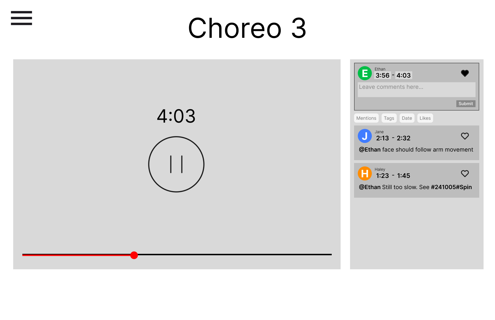
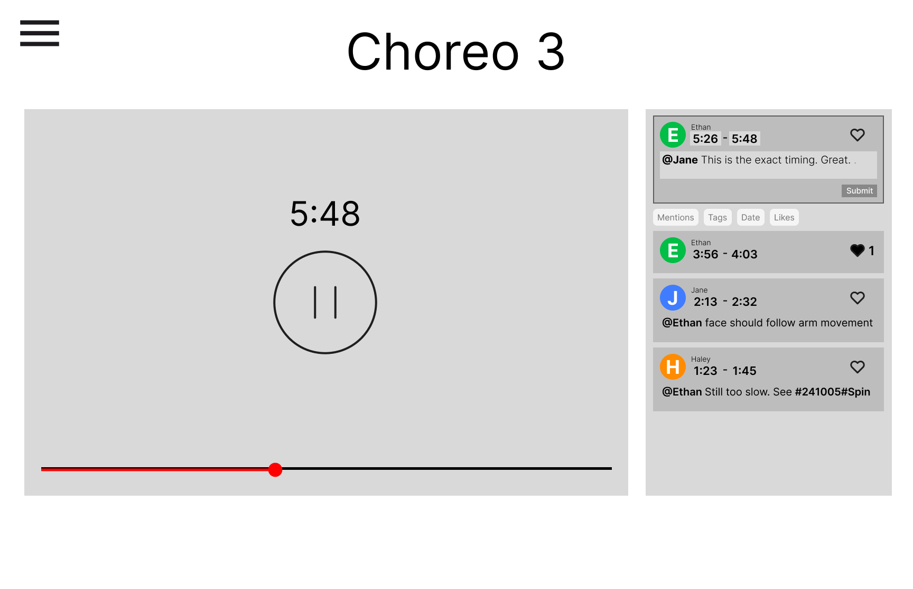
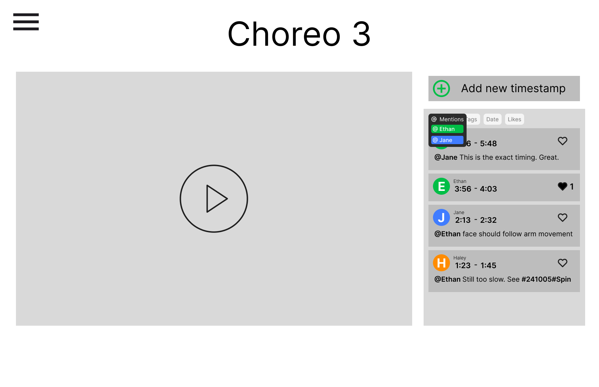
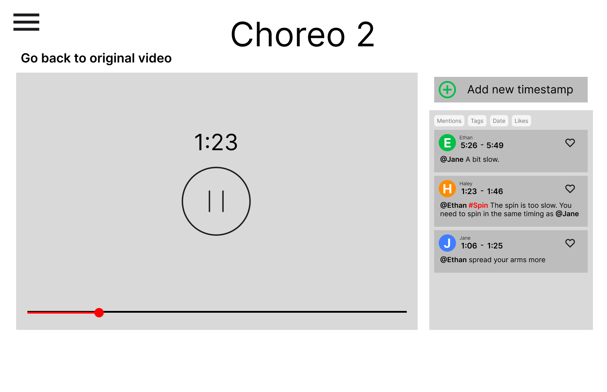
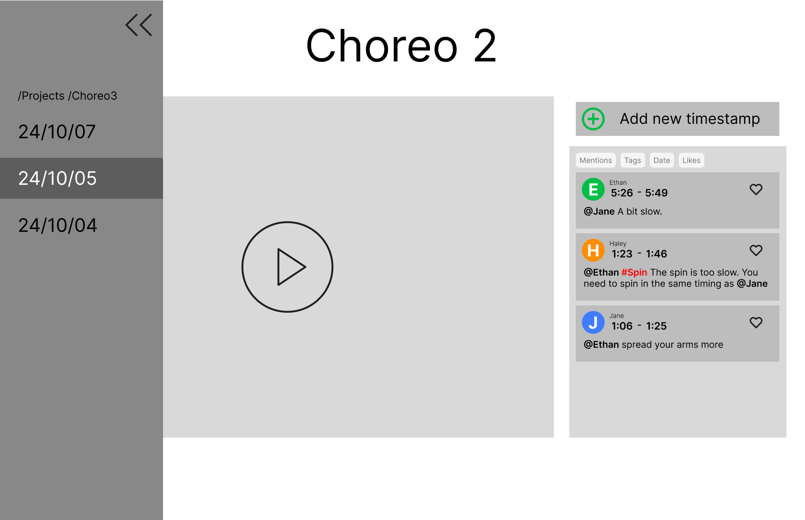

# Problem Statement

> Collaboration is crucial in choreography, but since the methods of collaboration are **unstructured**, there is a lot of **inefficiency in communication** such as **misunderstandings between members** and **ambiguity in directions**.

# Tasks

1. **Leave a Positive Reaction to a Specific Part of the Video**: As a user, I can quickly leave a positive response or write a nice comment on a particular segment of the video if I witness a good performance during the choreography. It allows me to express my feedback in the exact timing and the reciever can also clearly understand my feedback. Also, this enables me to easily offer encouragement or support without disrupting the session's flow, which makes it simpler to inspire and uplift my team members.
2. **Filtering comments**: Filtering comments by mentions, hashtags, latest comments, and likes allows me as a user to easily find comments that I am searching for. I can easily focus on comments left for me, search by tags, review feedback from the latest dates, or sort by likes to see the most appreciated comments. This makes the communication efficient for the entire team.
3. **Search and Review Previous Versions of the Choreography**: As a user, I am able to go back and look at previous versions if I need to revisit earlier choreography sessions. Being able to understand the evolution of certain movements or arrangements in the choreography will help me undertstand the big picture of the choreography. This will definitely make tracking progress much easier, including staying on the same page as the team when it comes to the creative process.

# Prototype

## Description

Our project is a website designed to help choreography team members collaborate more effectively. Members can view previous practice session videos and share reactions at exact moments within the footage. In the real world, verbal feedback often gets lost or forgotten; however, with this tool, feedback and reactions are documented and easily accessible for everyone to apply to their work. The video history function allows members to track progress by reviewing past performances and associated feedback. This structured method of communication not only highlights areas of improvement over time but also leads to more effective collaboration among team members.

## Link

https://www.figma.com/proto/VCnWUDnbYGFUMuXyuXk55L/Pitch-ideation?node-id=55-4&t=1RmG9hT6HX8Unz7l-1

## Design Choices

- Video processing/viewing is not implemented in the low-fi prototype stage because it is hard to implement this in figma. We presented a scenario where the user pauses the video to leave a comment, and we decided that demonstrating this functionality would be sufficient.
- Visual elements such as colors or precise sizing were not taken into consideration in the low-fi prototype. We thought it was enough to use limited colors and clear outlines to express the functions we wanted to deliver.
- Functions not related to the main tasks such as login or user page are not included.
- Conditional functionalities such as viewing comments that are in a specific time phase was not implemented due to limitations in figma.
- Typing is not implemented and replaced by hard-coded data due to limitations in figma.
- Filtering is implemented only for mentions because the other filters work the same way.

## Representative Screenshots

1. **Leave a Positive Reaction to a Specific Part of the Video**

Leave a like to a part of the video

Leave a constructive comment to a part of the video

1. **Filtering comments**

Click on @Mentions to choose the category to filter with

Contents filtered with “Ethan”

1. **Search and Review Previous Versions of the Choreography**

Directly go to the tag by clicking on the tag. Go back to the original video by clicking “Go back to original video”

Use the sidebar to navigate through different choreography versions

## Instructions

Click on the link provided above and follow the following steps.

### Task 1: Leave a constructive response to a part of the choreography session video.

Just leave a like

- Step 1: Open the choreography video and play it.
- Step 2: When you reach the moment you like, click on “Add new timestamp”.
- Step 3: Click on the heart to express your liking for that specific part of the video.
- Step 4: Click the place to input the end time for the portion of the video you want to highlight.
- Step 5: Click submit to upload the like.

Leave a positive comment

- Step 1: Keep playing the choreography video.
- Step 2: When you reach the moment you want to leave a comment, click on “Add new timestamp”.
- Step 3: Click on the section that says “Leave comments here” to leave a positive comment.
- Step 4: Click the place to input the end time for the portion of the video you want to highlight.
- Step 5: Once you are satisfied with your comment, click submit to save it and share your response with the team.

### Task 2: Filtering comments

- Step 1: Go to a video where you want to look for comments.
- Step 2: On top of the comments section there are tags which users can use to filter the comments.
- Step 3: Click on “@Mention” and choose “Ethan”. You will be shown comments only related to “Ethan”.
- Step 4: Click on “@Mention” again to turn the filter off.

### Task 3: Search and Review Previous Versions of the Choreography:

- Step 1: Open the current choreography video.
- Step 2: Click the button of the sidebar to open a sidebar.
- Step 3: In the sidebar, you’ll see a list of previous versions of the video. Click on the date of the version you want to access.
- Step 4: The selected version will be loaded, and you can now watch and analyze the previous choreography session.
- Step 5: You can use the sidebar to go back and forth between versions.

or

- Step 1: Open the current choreography video.
- Step 2: Click the tag that you want to go to.
- Step 3: The click will automatically direct you to that date and part of the video. The comment mentioned will be emphasized in red.
- Step 4: You can go back to the original video by clicking “Go back to original video”.
