Instruction# [ThunderHawk] DP4 High-fi Prototype

20190447 Dongseop Lee, 20200096 Seyeon Kim, 20200872 Nuzup Shadiev

---

# Project Summary

Collaboration is crucial in choreography, but since the methods of collaboration are unstructured, there is a lot of inefficiency in communication such as misunderstandings between members and ambiguity in directions. Therefore, we propose a solution to help choreography members collaborate more effectively by providing a collaborative website where users can share structured feedback on practice session videos. We have functions especially for choreographers such as timestamped comments, mentions and tags for specific people or scenes in choreography and according filters for the comments, and easy reviewing of past performances, so that users can communicate much more clearly and easily.

# Instruction

1. Register to the website
   1. If you don’t want to Sign Up, you can use this ID
      1. ID: seyeon@kaist.ac.kr
      2. PW: seyeon
   2. Log In

      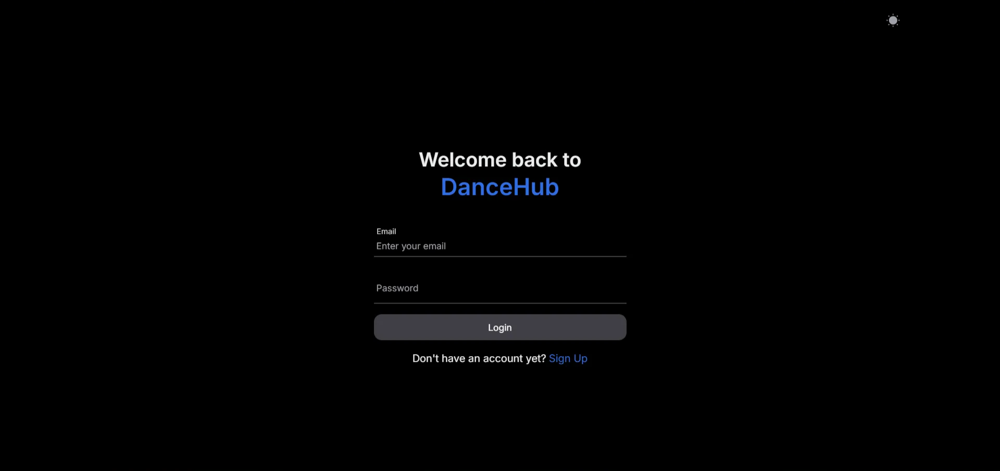

      Enter your Email and Password to log in. If you don’t have an account, you can sign up by clicking “Sign Up”.

   3. Sign Up

      1. You can Sign Up with a fake email.

      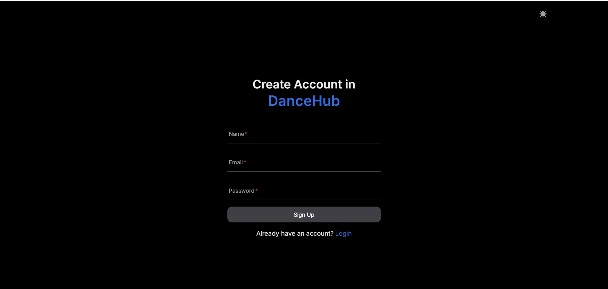

      Enter your Name, Email, and Password to sign up to the website. The Name entered here will be used as your name for mentioning. You can automatically log in after you sign up.
2. Create or join a project
   1. Create a project

      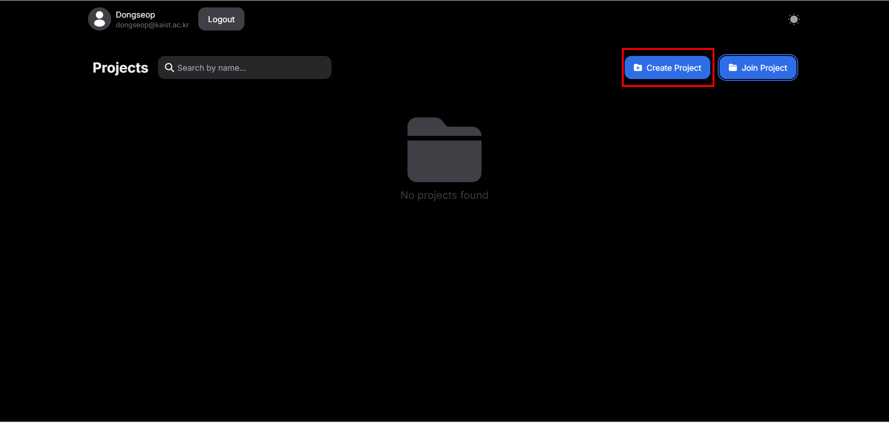

      Click the “Create Project” button to create a new project.

      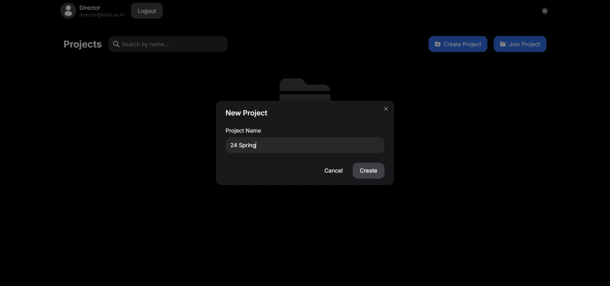

      Type the name of the project. Click the “Create” button to create new project.

   2. Join a project

      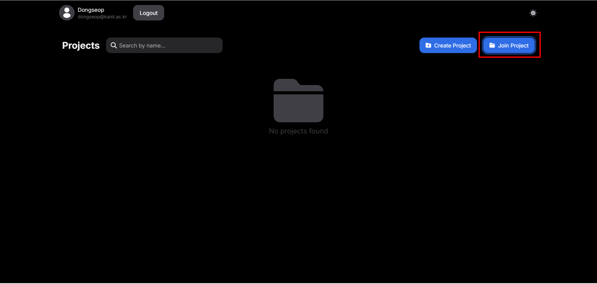

      Click the “Join Project” button

      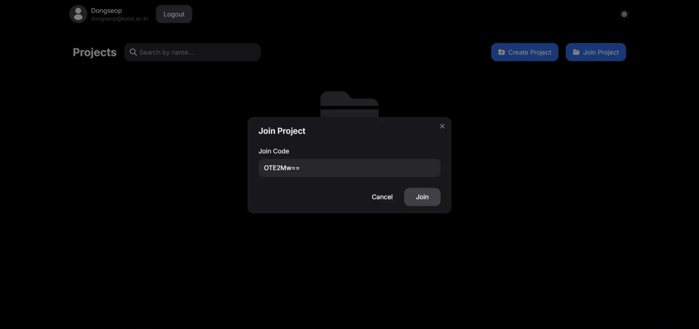

      Enter the Join Code. Click the “Join” button to join the project.

      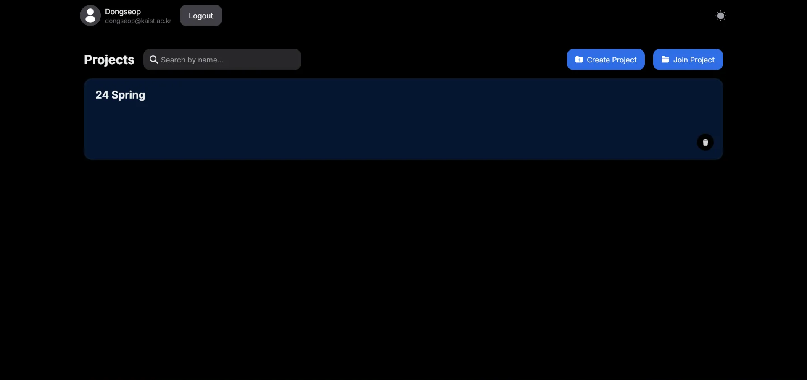

      Project joined. If there is something wrong, refresh the page.
3. Upload a new video

   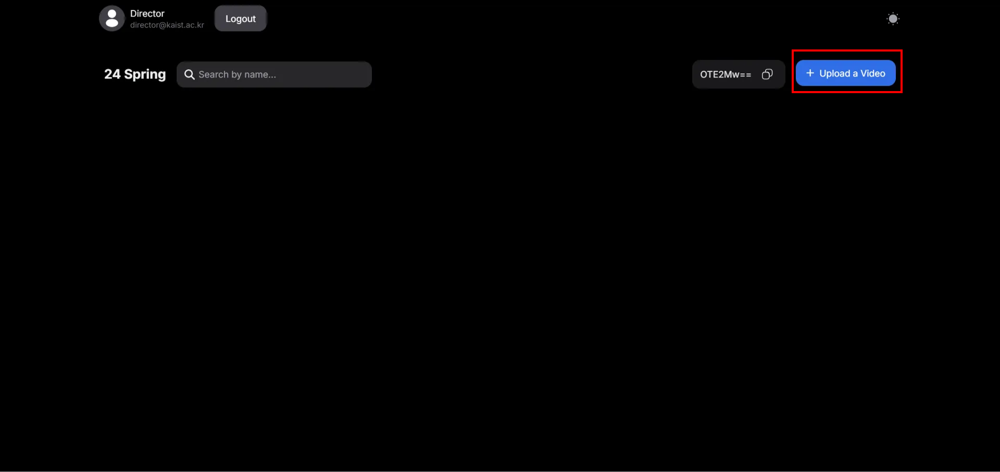

   Click the “Upload a Video” button to upload a new video.

   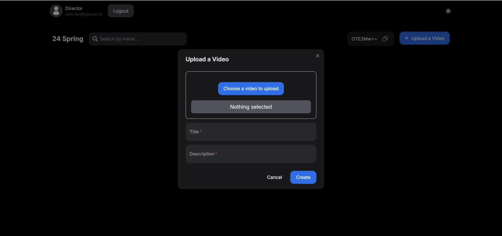

   Click the ”Choose a video to upload” button and choose a video you want to upload. Write the title and description of the video. Click the “Create” button and wait until it is uploaded.

   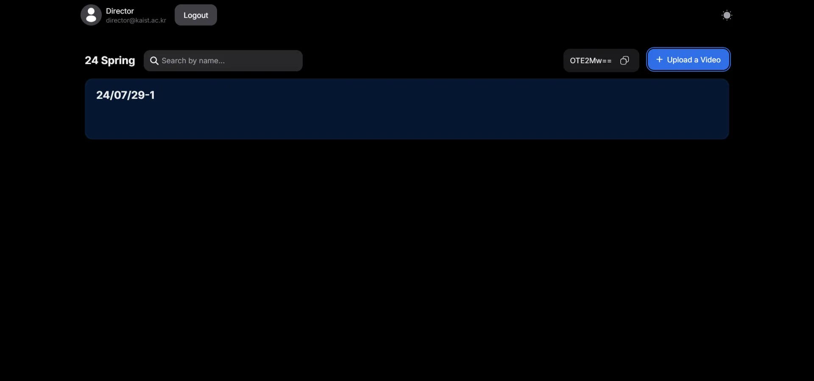

   The video is uploaded.

4. View videos and leave comments
   1. View the video

      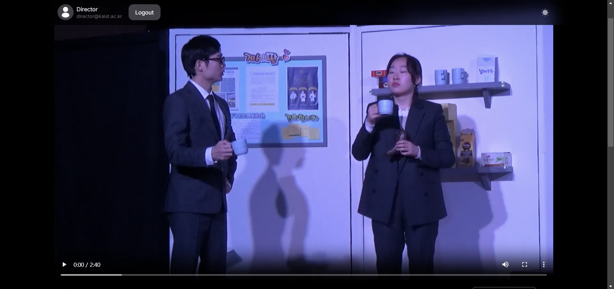

      Click anywhere on the video to play the video.

   2. Leave comments

      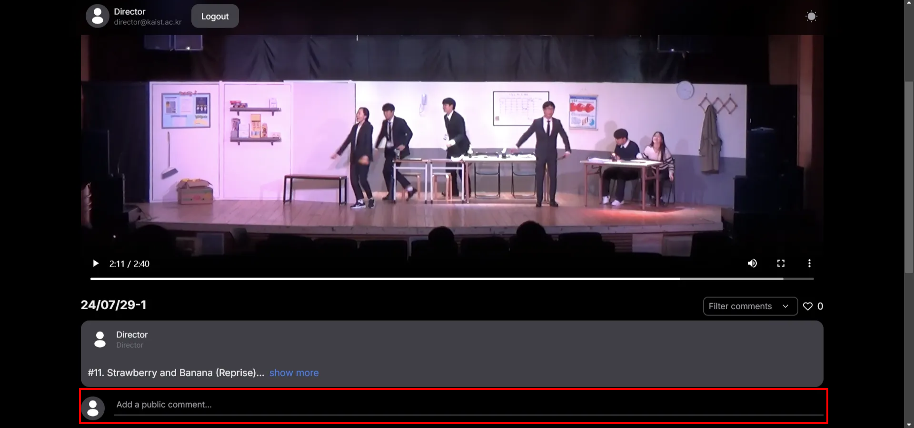

      Click the section that says “Add a public comment…” to add a comment.

      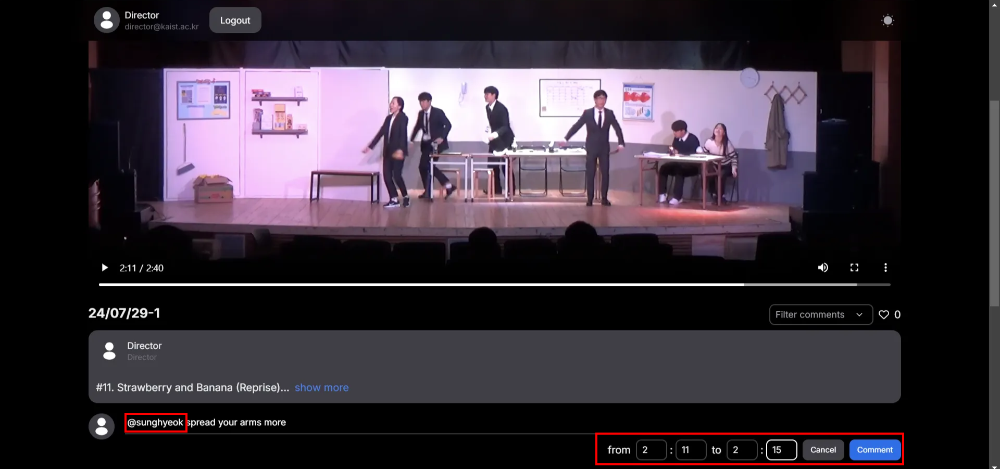

      Use @ to mention someone in the video. Leave timestamps for the specific part of the video.
5. View comments
   1. Go to timestamp of the comment

      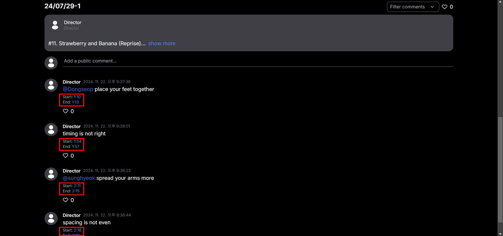

      Click on the timestamp to go to that part of the comment.

   2. Like comment

      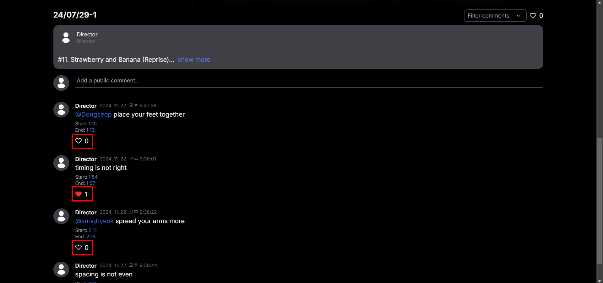

      Click on the like button to show your agreement to the comment.

   3. Filter comment

      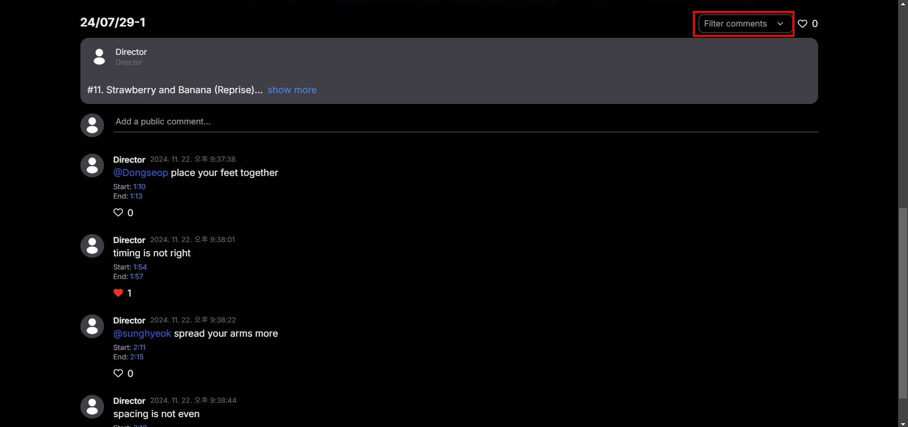

      Click on “Filter comments” to filter comments

      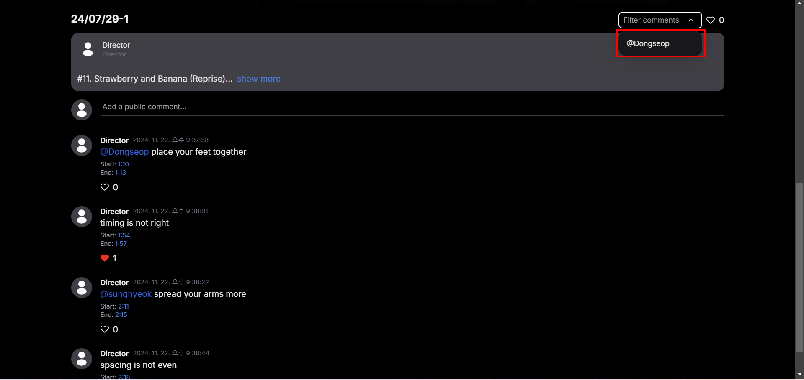

      Click on @Dongseop to filter comments left for me (Dongseop)

      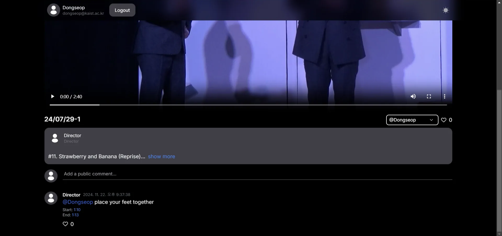

      Comments will be filtered.

# URL

## URL of prototype

[https://dancehub-9cfw.vercel.app/](https://dancehub-9cfw.vercel.app/)

## URL of Git

[https://github.com/nuzupshadiev/dancehub](https://github.com/nuzupshadiev/dancehub)

# Libraries and Frameworks

- Frontend
  - Next.js
  - Tailwind CSS
- Backend
  - Server
    - framework: Express (Node.js)
    - Language: Typescript
    - Typescript(Javascript) libraries
      - Config: dotenv
      - JWT Credential: jsonwebtoken
      - Handling files: multer
      - Database connection: mysql2
  - Database
    - Mysql
  - Testing
    - Postman
  - Deployment
    - Goorm ide (cloud service for education)

### Coding Support Tools

- ChatGPT
- VSCode as text editor

# Individual Reflections

## Dongseop Lee

### What I contributed

1. Define API Requirements

At first, I wrote a basic api document for our service. Based on the document, Nuzup Shadiev and I debated on how api should be. Main consideration was the trade off between api’s functionality and logic complexity. After finalizing api requirements, We could start implementing each part based on the document.

1. API Implementation

I take development of whole back-end logic. Based on the finalized api document, I implemented all of requirements listed on it. This work includes data model design, server logic implementation with Typescript, and server deployment. During the development, every api endpoint was tested with Postman by me and confirmed by Nuzup.

### Difficulties I faced

1. Attempt to adopt Nest.js

My first plan was adopting Nest.js to build more well-structured server. Nest.js is a framework for constructing a Node.js web application, which is usually used for building back-end server. However, I encountered some problem(steep learning curve, bad compatibility with mysql, high-level abstraction of database which is confusing to me). So, I just decided not to use Nest.js and start with a simple Express server for fast prototyping. However, the try helped me when I make the code structure.

1. Mixed content error

Our deployed front-end server serves web page through only https. Meanwhile, back-end server serves api through only http. That caused “Mixed content error” when front-end server gets data through http and deliver it through https. It can be resolved by setting “allow unsafe data” as “allowed” in site setting, but we found that fetching static data like video directly is not allowed even if “allow unsafe data” is on. After some research, I found an easy way to deploy and serve api through https, and it worked. Now, our prototype link does not require “allow unsafe data” setting.

### Skill I learned

If I pick one skill I learned working on high-fi prototype, it is coordination skill. Before this, I didn’t know how to handle coordination problem especially in coding projects. Through the high-fi prototype implementation, we clearly divided work and actively communicated in bridging points like api document. And it was very fortunate that every member of our team had one’s own field. I think that kind of coordination and cooperation really worked well in this case, and that’s the most valuable thing what I’ve got in this project.

## Seyeon Kim

### What I contributed

I designed the website using Figma, making decisions on how specific features should be implemented and how different sections would be connected. However, there were challenges in aligning my designs with the library components intended for the frontend, which resulted in some parts of my design not being fully reflected in the actual website. Moving forward, I will focus on refining interface details such as layouts and resolving heuristic design issues. Additionally, some functionalities were not implemented as intended, so I will work with the team to test and improve these areas.

### Difficulties I faced

As someone with experience primarily in coding from scratch, I initially struggled to understand and work with libraries like Tailwind CSS. The lack of prior experience in this level of programming also made communication with the team more difficult at times. However, my teammates provided invaluable support in setting up the environment and helping me acquire new skills.

### Skill I learned

Through this project, I gained a deeper understanding of frameworks and libraries, realizing how significantly they can streamline the development process. Previously, I had designed all elements manually in my projects, but using libraries not only made the website look more polished but also simplified the workflow. This experience has broadened my perspective on efficient web development practices.

## Nuzup Shadiev

### What I contributed

I directly contributed to the development of the frontend of our collaboration platform in DanceHub. I constructed the intuitive and visually appealing user interface using Next.js and Tailwind CSS, which supports the core features of the platform. I did that by implementing the pages for projects, displays of videos, interactive comments, likes, and mentions. I also contributed to the feature of uploading and managing various versions of a video within a project. Seamless and engaging user interaction was, hence, one of the most important aspects in my development process.

### Difficulties I faced

One of the challenges was to provide a dynamic and responsive layout that would support multiple interactive elements, including the video player, comment threads, and version toggles, without compromising on usability or aesthetics. The @mention in the comment system was another tricky feature to be implemented because of the search of users and real-time rendering. Further, in the testing of the frontend, much debugging was required to see that everything works properly.

### Skill I learned

One useful skill that I learned during this project was how to implement real-time interactive features in the frontend. For instance, I enhanced my efficient management of state and integration of dynamic functionality, such as updating like counts and comments handling. In this regard, I deepened the development of responsive design principles and how to use Tailwind CSS utilities for developing adaptive layouts for devices and consistency of experience.

Working on this platform provided a unique opportunity for me to apply my technical skills to creative and socially impactful projects that helped me grow as a developer.
