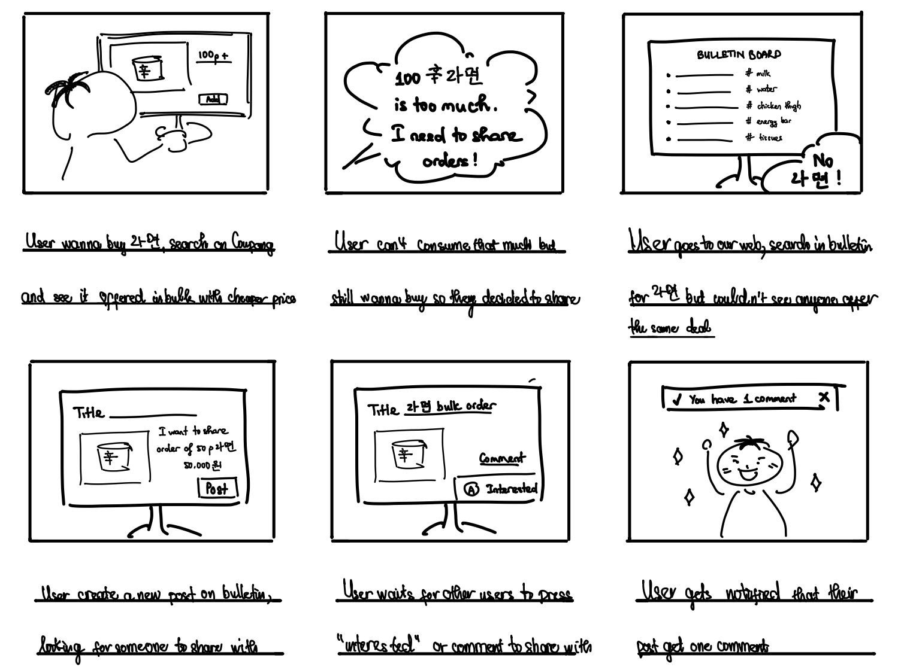
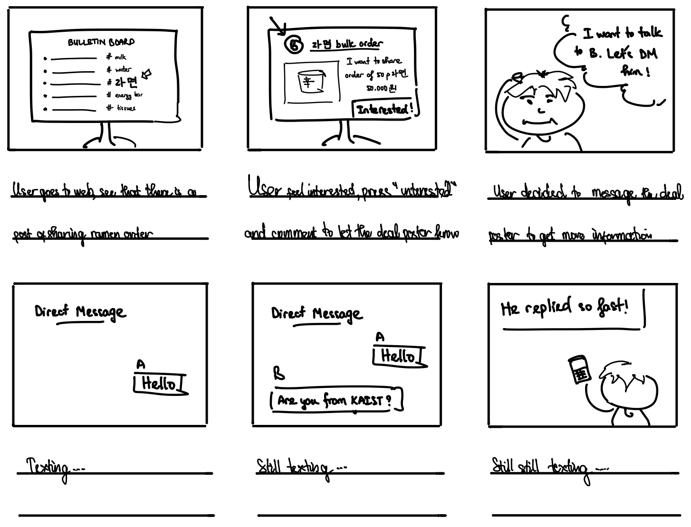
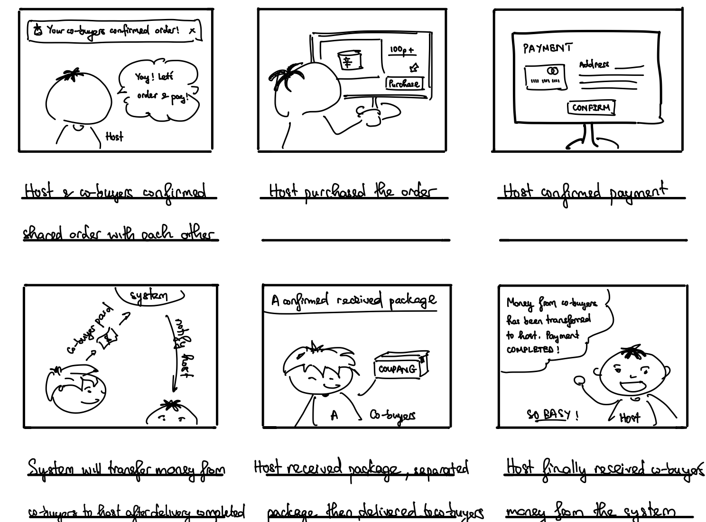

# Split-n’-share
## CS473 Introduction to Social Computing - 2024 Fall  
**Project 1: Ideation**  
Nghiem Xuan Son  
Thuy Trang Nguyen  
Mai Nguyen  

---

### Problem Statement  
Many online shopping platforms provide discounts for bulk purchases—or sometimes items are only offered in large quantities—but you may not need to buy such a large quantity while still wanting to benefit from the reduced price.

---

### Problem Background

By surveying the web for studies and news articles regarding bulk purchasing, we found that this issue is widespread and increasingly relevant today. According to *The Psychology of Discounts*, shoppers are more likely to buy more when offered bundles or multi-buy deals, as they do not need to justify individual item purchases[^1]. A survey of 2076 university students conducted by *Korea JoongAng Daily* found that 56% struggle most with rising food costs[^2]. Many students try to cope by buying cheaper bulk products and splitting them with peers, but loyalty prices can often lead to overspending, as highlighted in a *BBC* article[^3]. To better understand the challenges of bulk purchasing among students, we conducted interviews with nine KAIST students from five different countries, including four male and five female participants with diverse shopping behaviors. We focused on their shopping behavior, discount preferences, bulk purchasing experiences, and collaborative group purchases. Many students regularly encounter items sold only in large quantities or at discounted rates for bulk purchases. While some have attempted group purchases with friends, most found it difficult to coordinate, citing issues like payment delays, lack of trust, and logistical challenges in distributing items. From these insights, we identified five major needs: the need to find matched co-buyers, the need to connect with trustworthy co-buyers, the need for secure and transparent payment handling, the need for convenient distribution of shared items, and the need to minimize communication effort while protecting privacy.

---

### Motivation

Our research and interviews revealed that group purchasing is often coordinated through in-person conversations or online messaging apps. However, these methods are inefficient for sharing information—verbal exchanges are slow to spread deals, and posts in messaging apps can get lost among other messages. Additionally, this lack of organization creates friction when managing payments and logistics. Social computing provides a platform where users can easily connect with other interested co-buyers, streamline payments and logistics, and foster an engaged and close-knit community. It also caters for the varying needs, preferences, and spontaneous deals that emerge from collaborative human interactions, which a fully automated system is not flexible for. It is also cheaper than retailers or other intermediaries, which add their own operational costs to the overall cost. Being flexible, low-cost, and community-driven, social computing is the ideal solution for our problem.

---

### How Might We (HMW) Questions

Based on our internal research and the challenges identified, we formulated the following 10 “How Might We” (HMW) questions that frame the problem space and guide our solution brainstorming:

1. How might we enable users to verify co-buyers' trustworthiness?  
2. How might we find co-buyers with the same need?  
3. How might we remove the communication barrier between co-buyers?  
4. How might we reduce the effort and awkwardness in coordinating shared purchases with others?  
5. How might we turn the challenge of distributing shared items into a convenient process?  
6. How might we help users avoid the discomfort of reminding others to pay or dealing with delayed payments?  
7. How might we provide a transparent payment process that reduces the risk of scamming between buyers?  
8. How might we make the process of sharing bulk purchases enjoyable and socially rewarding?  
9. How might we reduce users' reluctance to engage with strangers due to trust concerns?  
10. How might we make users feel comfortable inviting others to participate in shared purchases?  

After discussing these questions, our team selected the following top 3 HMW questions to focus on for generating solution ideas:

1. How might we find co-buyers with the same need?  
2. How might we remove the communication barrier between co-buyers?  
3. How might we help users avoid the discomfort of reminding others to pay or dealing with delayed payments?  

---

### Solution Ideas

For each HMW question, we propose 5 solution ideas:

**HMW 1: How might we find co-buyers with the same need?**  
- Create online forums or groups within a platform where users can join based on specific interests or product categories.  
- Implement a matching system that pairs users looking to buy the same items in real-time based on their search queries or wishlists.  
- Provide a virtual bulletin board where users can post and browse listings for bulk purchases they are interested in sharing.  
- Organize scheduled events for popular products where users can sign up in advance to participate in a bulk purchase.  
- Utilize geolocation to suggest potential co-buyers who are nearby and interested in the same products.  

**HMW 2: How might we remove the communication barrier between co-buyers?**  
- Offer a set of common message templates for initiating conversations, confirming orders, and coordinating logistics.  
- Provide an in-app messaging system that allows users to communicate without sharing personal contact information.  
- Implement a shared calendar where co-buyers can indicate their availability for pickups or deliveries using visual cues, reducing the need for detailed discussions.  
- Provide shared documents or lists within the platform where co-buyers can collaboratively input information like quantities desired, preferences, and notes.  
- Use icons, status indicators, and pre-set responses (e.g., thumbs up, checkmarks) to convey messages without typing.  

**HMW 3: How might we help users avoid the discomfort of reminding others to pay or dealing with delayed payments?**  
- Require all co-buyers to pay their share upfront to the app before the group purchase is finalized.  
- Implement an automated reminder system that sends notifications to users about upcoming or overdue payments.  
- Establish a credit system where users earn or lose points based on their payment behavior, affecting their reputation or incurring penalties on the platform.  
- Break down payments into smaller milestones (e.g., deposit upon joining, balance before shipping) with automated notifications for each stage.  
- Introduce an in-app wallet where users can deposit funds in advance and use the balance for group purchases.  

---

### Top 3 Solution Ideas Overall

1. Provide a virtual bulletin board where users can post and browse listings for bulk purchases they are interested in sharing. (HMW 1)  
2. Require all co-buyers to pay their share upfront to the app before the group purchase is finalized. (HMW 3)  
3. Provide an in-app messaging system that allows users to communicate without sharing personal contact information. (HMW 2)  

---

### Storyboards

**Virtual Bulletin Board**  
This feature allows users to post and browse listings for bulk purchases they are interested in sharing. It provides a central space where users with similar purchasing needs can easily find and connect with each other, facilitating group buying.

**In-App Messaging System**  
This feature enables users to communicate directly within the platform without sharing personal contact information. It simplifies coordination between co-buyers, allowing them to discuss details like product quantities, logistics, and preferences while protecting their privacy.

**Upfront Payment System**  
This feature ensures that all co-buyers pay their share of the purchase before the group order is finalized. Payments are securely held by the app until the items are delivered, reducing the risk of delayed payments or disputes and ensuring commitment from all participants.

---

### References

[^1]: Yard L. (2024 March 27). The psychology of discounts. Last Yard. https://lastyard.com/the-psychology-of-discounts/  
[^2]: University students find new ways to get affordable meals. (2024 April 2). https://koreajoongangdaily.joins.com/news/2024-04-02/national/kcampus/University-students-find-new-ways-to-get-affordable-meals/2016361  
[^3]: Meierhans J. (2024 May 29). Warning supermarket loyalty “challenges” could cause overspending. https://www.bbc.com/news/articles/ceq33z0gxj4o  
