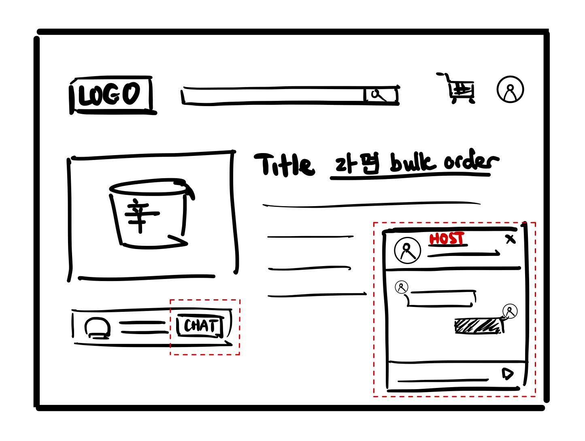
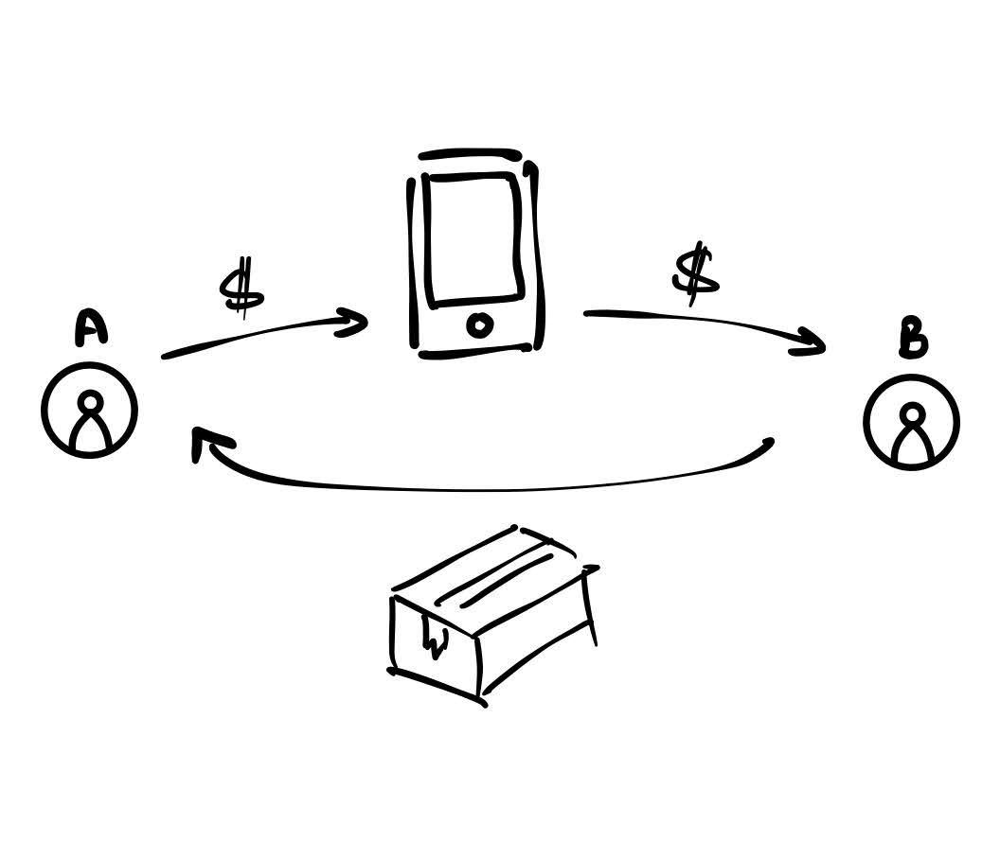
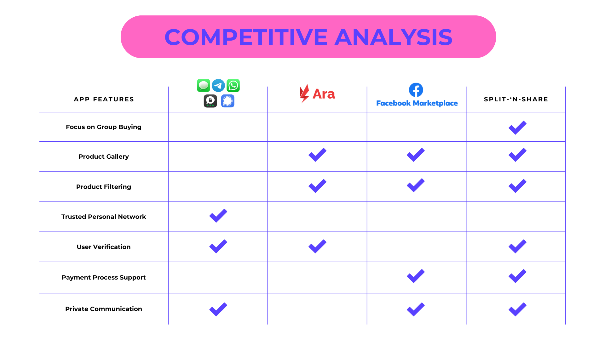
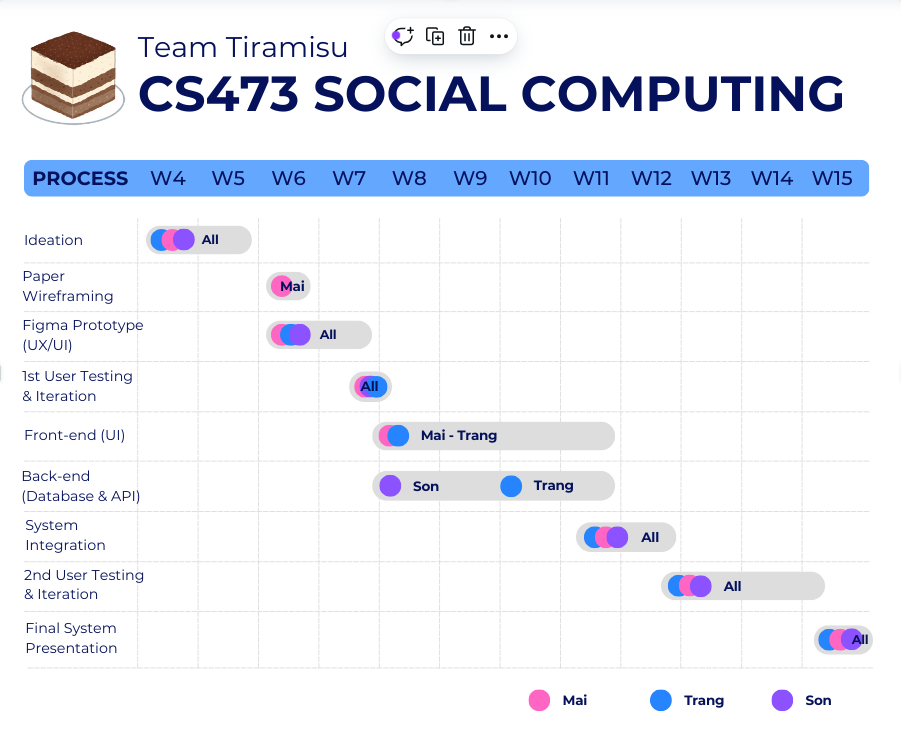

# Split-n’-share
## CS473 Introduction to Social Computing - 2024 Fall  
**Project 1: Ideation**  
Nghiem Xuan Son  
Thuy Trang Nguyen  
Mai Nguyen  

---

### Problem Statement  
Many online shopping platforms offer bulk discounts or sell items exclusively in large quantities, creating a challenge for individuals who want to benefit from reduced prices but struggle with the logistical and financial burdens of acquiring and storing excess quantities.

---

### Our Solution
Our website, **Split-n'-share**, targets KAIST students, specifically students who are living in the campus’s dormitories, who are interested in taking advantage of bulk discounts but lack the need or resources to purchase large quantities by themselves. To address this challenge, the website facilitates group purchasing by allowing students to connect, communicate, and ensure transparent payment handling, making it easier to split large orders while benefiting from discounts.

Our website includes 3 major features:

1. **Product Grid**
    - Users can post, browse, and join shared buying opportunities. The product grid is designed to be visually appealing and easy to navigate, featuring filters such as price, category, popularity, or location.   
    - **Value to Users**: Users can easily browse relevant group-buying deals tailored to their preferences, turning shopping into a more enjoyable and collaborative experience.

    - Storyboard

2. **In-app Messaging System**
    - This system allows users to communicate securely within the app without sharing personal contact information. Users can participate in individual or group chats and share details such as images or links to deals.
    - **Value to Users**: Provides seamless communication between organizers and co-buyers, helping to clarify deal specifics and coordinate details efficiently.

    - Storyboard

3. **Upfront Payment System**
    - The app ensures secure transactions by holding the co-buyers’ payments until the group purchase is completed. Once the items are delivered and confirmed, the payments are released to the organizer.
    - **Value to Users**: Organizers benefit from reduced stress by avoiding last-minute cancellations or chasing payments. Co-buyers can feel secure knowing their payment is held safely until they receive the items.

    - Storyboard

---

### Core Tasks

The following are the core tasks that the system will support, each crucial to the platform’s functionality and directly addressing this problem:

#### Task 1: Promoting a Bundle Deal to Attract Co-Buyers

After discovering an attractive bundle deal on an e-commerce site, the user goes to our bulletin board to create a new group-buying post. They enter the details about the deal they found and the amount of co-buyers they’re looking for before posting. 

→ The task is core to the solution because it helps users gather enough participants to successfully complete a group-buy, which is essential for unlocking shared discounts. 

#### Task 2: Browsing for Cheap-Buying Deals 

The user browses the bulletin board in search of interesting deals to purchase. Upon finding an appealing post, they click on it to view more details about the deal and the organizer, or alternatively filter posts based on criteria such as price, product type, distance, etc.

→ The task is core to the solution because it allows users to easily find and explore various group-buy deals, helping them access discounts and savings opportunities. 

#### Task 3: Communicating with Co-Buyers/Organizers

The user finds a deal interesting on the bulletin board, and they want to find out more about it so they directly message the poster via our in-app service. The poster can then address the user’s questions and provide additional details, fostering a more informed decision-making process.

→ The task is core to the solution because effective communication is essential for coordinating and ensuring smooth group-buy transactions.

#### Task 4: Coordinating Payment and Delivery

The user and the organizer agree on a deal. Next, the organizer makes the purchase, the user together with other co-buyers pays their share to our platform, before the items are delivered to each and upon confirmation the money is transferred to the organizer.

→  The task is core to the solution as it ensures co-buyers pay upfront through the platform, securing funds and protecting both buyers and the organizer by guaranteeing that the organizer is paid and the package is delivered to the co-buyers.

---

### Competitive Analysis

Here is a comparison of Split-n'-share against three main alternatives: ARA, Facebook Marketplace, and messaging platforms such as Telegram, WhatsApp and Facebook Messenger. The table below highlights the key features that differentiate these platforms, focusing on group-buying, product display, filtering, network trust, payment support, and communication privacy.

#### Ara

ARA excels in group buying with its product gallery and advanced filtering options tailored to the KAIST community. However, it lacks a secure payment system, making transactions riskier compared to Split-n'-share, which ensures secure upfront payments and a broader user base.

#### Facebook Marketplace

While Facebook Marketplace offers a wide variety of products and easy navigation, it lacks dedicated group-buying features and a secure payment system. Split-n'-share is more suited for KAIST students as it focuses on group purchases and provides integrated payment support.

#### Messaging Platforms

Messaging platforms allow for private communication but lack any structure or features for group-buying coordination. Split-n'-share addresses this with dedicated group-buy tools and secure payment handling, offering a streamlined and reliable solution for students.

---

### Timeline and Responsibilities

For the low-fidelity prototype, Mai will be responsible for researching and brainstorming UI feature designs. She will sketch the wireframe on paper, which will serve as a foundation for the team to build the Figma prototype. The project will be divided into four key tasks: Mai will handle the first task about the product grid; Son will manage the posting feature and direct messaging; and Trang will be responsible for the payment functionality. Once the low-fidelity prototype is complete, we will recruit test users and conduct an initial round of user testing. Based on the feedback, we will iterate to address any usability or efficiency issues before moving on to coding.

For the high-fidelity prototype and coding phase, the team will begin by finalizing the tech stack. Mai and Trang will then work together to refine the UI and implement the front-end code, both focusing on styling and layout using CSS, as well as handling interactive features and DOM manipulation with JavaScript. At the same time, Son will design the database infrastructure, validate data, and implement the core back-end logic, including API functions. Trang will join midway to assist Son in connecting the back-end with the front-end, focusing on API integration with the UI and ensuring smooth data flow between the front-end and the database. Once the front-end and back-end are fully integrated, the team will recruit users for further testing and analyze interaction data to gather insights for platform improvements.
