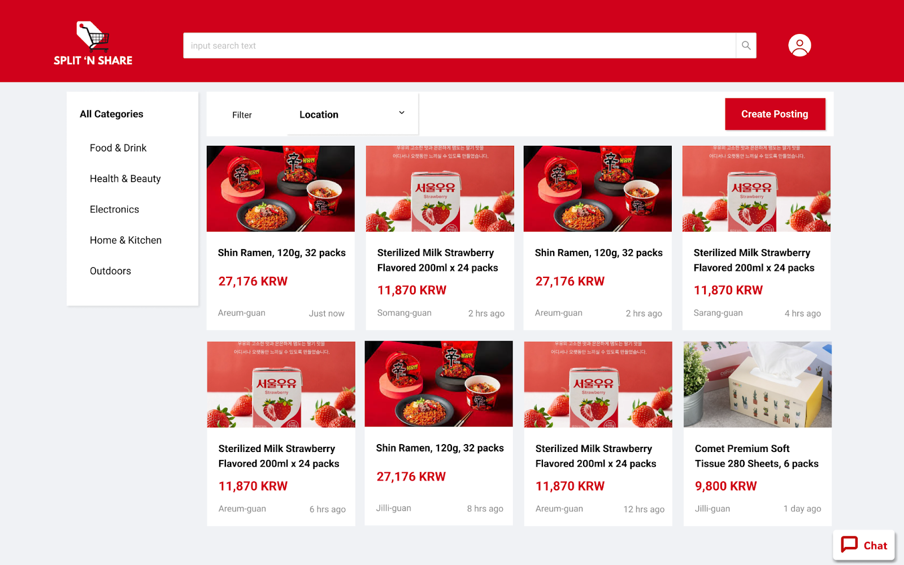
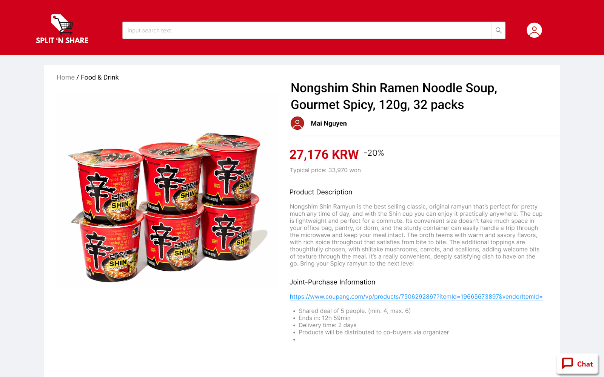
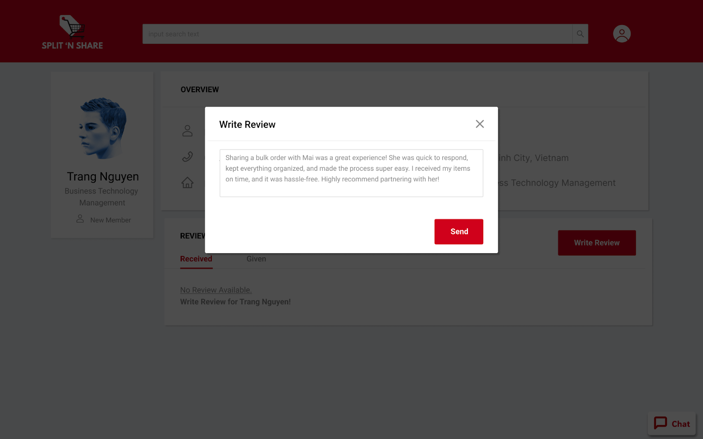
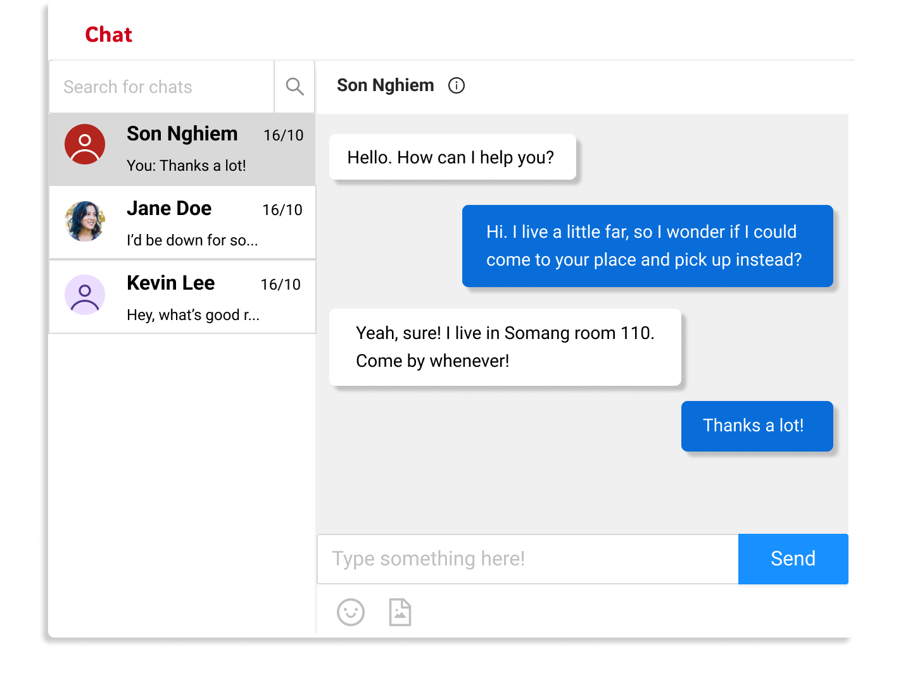
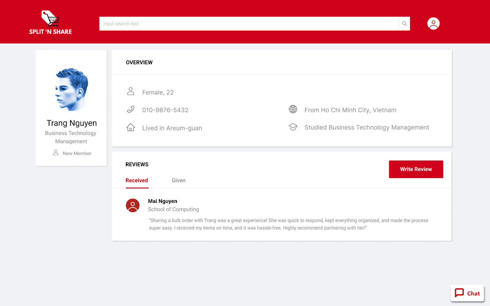
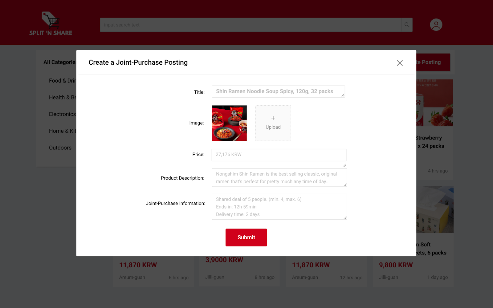

# Split-n’-share
## CS473 Introduction to Social Computing - 2024 Fall  
**Project 1: Ideation**  
Nghiem Xuan Son  
Thuy Trang Nguyen  
Mai Nguyen  

---

### Problem Statement  
Many online shopping platforms offer bulk discounts or sell items exclusively in large quantities, creating a challenge for individuals who want to benefit from reduced prices but struggle with the logistical and financial burdens of acquiring and storing excess quantities.

---

### Tasks

In our prototype, we will support 3 core tasks as follows:

#### Task 1: Browsing for Cheap-Buying Deals

The user browses the product grid feed in search of interesting deals to purchase. They can either surf the product grid as-is or filter by product categories and/or pick-up location to get a feed tailored to their preferences. The user then clicks on a post they find interesting to view more details about the deal and the organizer. 

#### Task 2: Communicating with Co-Buyers/Organizers

The user finds a deal interesting on the product grid, and they want to find out more about it so they directly message the poster via our in-app service. The poster can then address the user’s questions and provide additional details, fostering a more informed decision-making process. Within the same channel, they can discuss issues such as pick-up location, time and payment methods, and if either party finds problems or dispute they can report it to our platform.

#### Task 3: Write reviews for past co-buyers

Upon finishing a deal, the user can navigate to the page of their past co-buyers and leave reviews for them. The reviews will show up on the public profile page of the recipient under the “Received review” section. Other users will be able to view these reviews, allowing them to make informed decisions before joining future deals.

---

### Prototype

#### Summary description and brief justification of our platform

Split-n'-Share is a platform designed specifically for KAIST students to share the cost and quantity of bulk purchases, making it easier to benefit from discounts without the hassle of excess. The app allows users to browse deals, communicate securely with co-buyers and organizers, and leave reviews for transparency. Since the platform is exclusively for KAIST students, it offers a safer, more trustworthy environment for transactions. The in-app messaging system ensures secure communication, and the review feature helps users evaluate the reliability of co-buyers, fostering trust and accountability within the KAIST community.

#### Link to our prototype

https://www.figma.com/proto/1J24yAN8hoNPyIwsFl964n/Split-n'-Share-Platform?node-id=92-0&node-type=canvas&t=D1QRui3TXkVVW5jw-0&scaling=min-zoom&content-scaling=fixed&page-id=92%3A0&starting-point-node-id=179521%3A5440

#### Design Choices

1. Manual product filtering algorithm

To simplify the prototyping process, we opted not to implement a fully automated product filtering system. Instead, we used a manual algorithm to simulate the filtering experience, allowing us to replicate the user’s browsing behavior without the complexity of coding intricate tagging and filtering logic. This choice helps us evaluate which filtering criteria are essential before committing to code development.

2. Fake product grid

Since we lack real users at this stage to generate group-buying posts, we chose to populate the product grid with hard-coded data rather than dynamically sourced content. We manually selected relevant bulk products (e.g., ramen, milk cartons, tissue packs) from Coupang, Shopee, and other e-commerce sites. This approach provides a realistic representation of what users would encounter, allowing us to flexibly adjust how products are displayed without relying on actual user-generated content at this stage.

3. Fake user profiles

We chose to omit the user authentication and profile creation process at this stage, instead creating fabricated user personas through various accounts on the platform. To simulate realistic user behavior, we manually generated personal data, such as names, contact details, and preferences, as well as user reviews, even though this information would typically be input by users during account setup, with reviews left by others in the network. This decision allows us to focus on the core interactions between users, such as posting and leaving reviews on co-buyers' profiles. Additionally, it enables us to explore and evaluate what information should be displayed on profiles before finalizing the design, without being sidetracked by the added complexities of account creation and authentication flows.

#### Representative Screenshots

In this part, we will include the representative screenshots of our 3 main tasks with 1 additional screenshot of the side task of posting new deals to the website.

*Main page with the product grid feed, filters, search bar, chat button.*

*Product’s detailed information page.*

*Writing a review for co-buyers on their public profile.*

*Floating chat box displaying conversation history with previously contacted users.*

*The reviews on an user's profile.*

*Create a deal posting by entering product details and submitting it to the product grid.*

#### Instructions

Instructions to running the prototype:

##### Task 1: Browsing for Cheap-Buying Deals

On the main page, there will be the product grid feed. In this task, assuming the user is a student living in Areum guan who is looking for some food to purchase for cheap and small quantities. The user will select “Food & Drink” in the “All categories” section, then proceed to choose “Areum guan” in the filter location. The user will then see the filtered feed, clicking in the first post of Ramen to see more details about the products and the organizer. 

##### Task 2: Communicating with Co-Buyers/Organizers

After carefully considering the product, the user decides to buy and initiates the chat with the organizer by clicking on the chat icon in the lower right corner. A chat with the organizer will be automatically created and the user can start chatting. The chat bubble can be closed and reopened from any page by clicking on the same icon again. The chat history will be stored. 

##### Task 3: Write the reviews for the past co-buyers

After finishing the deal, the user will click in the profile of themselves to see the list of past co-buyers. The user then proceeds to click in the profile of the co-buyer that they have just finished the deal with. Here they will see the profile of the co-buyer. In the “Received” section of “Reviews”, they will see a button for adding a new review. They can start writing and after posting, the review will be shown in the “Received” section of the co-buyer and in the “Given” section of the user. 
