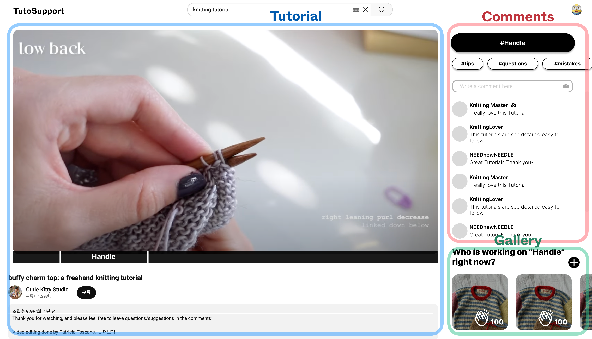
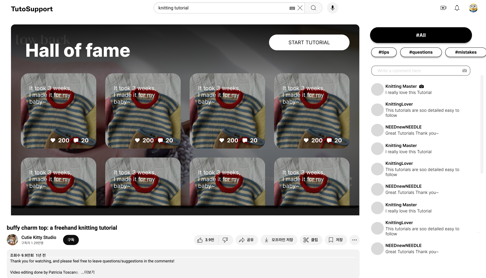
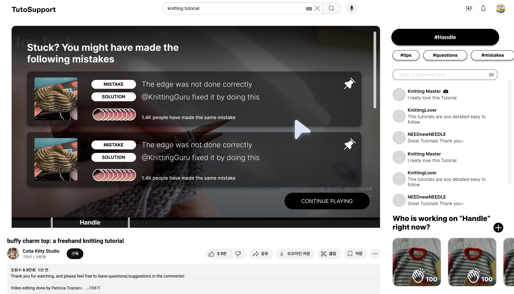
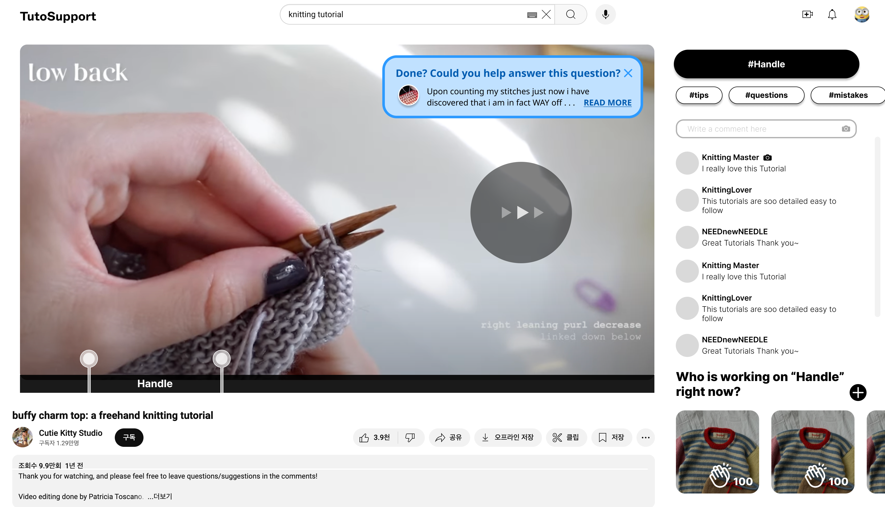
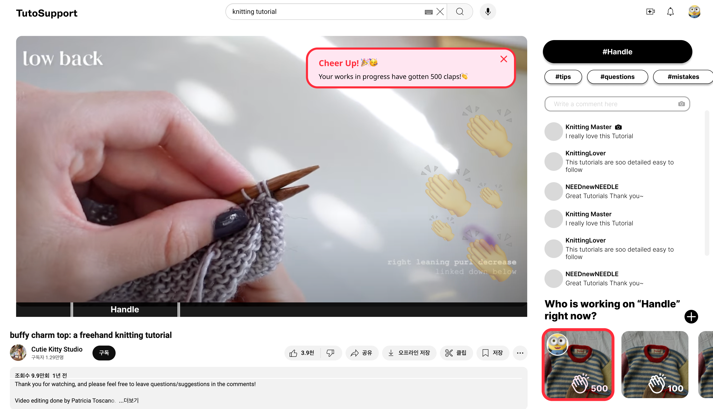
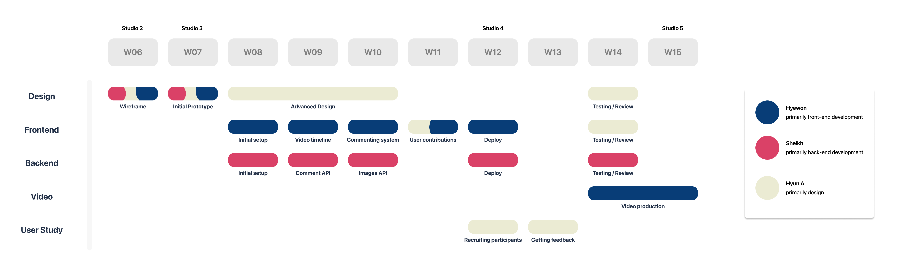

# **Report**

> Team Name : **TutoSupport** 
> Team Members: Hyewon Lee(20200529), Hyun A Kim (20210830), Sheikh Shafayat (20200873)

# **Problem Statement**
---

With the **traditional commenting** system, it is hard to get **suitable inspiration and feedback** while following video tutorials on **hands-on tasks**.

> *Hands-on tasks* indicate the activities that require physical manipulation, practice or experience. We are more focusing on tasks that incorporate creativity in this project.

# **Solution**
---

**TutoSupport** is a social system for video tutorials on hands-on tasks that **allow users to easily get suitable inspiration and feedback** while following the tutorials.

Our core values offered to users include 1) Inspiration that one can adapt to one's work 2) Emotional support 3) Tips and feedback that help task completion.

Our target users are people who watch and follow video tutorials on hands-on tasks. We are targeting both beginners, who benefit the most from feedback, as well as experts, who will likely gain the most from inspirational outputs.

**TutoSupport** consists of 3 main parts.

1. **Tutorial**
    
    Users can see and interact with tutorial video.
    
2. **Comments**
    
    Users can upload a comment with pictures or video. When users are uploading the comments, they can select which task section to upload and add category tag(e.g. tips, questions, mistakes). User can interact with the comments by pushing *Helpful* or leaving sub-comments. The mistake tagged comment that receives the most *Helpful* will be posted on the Common Mistakes board(Core Task#2).
    
3. **Gallery**
    
    Users can share the picture of one’s work on different stages. Users can give *Claps* to encourage others, and the system will notify them when they receive *Claps*. The picture that receives the most *Clap* will be posted on the Hall of Fame board(Core Task#1).
    

# **Core Tasks**
---

1. **Finding inspiration from different users’ works.** When users start the tutorial, they will see a curated collection of other users’ works before they can move on to the video. *This is core to our solution* because people engaging in hands-on tasks often rely on community-driven ideas to spark their own creativity; other people’s variations can serve as inspiration for users to enhance their own projects.

    
    
2. **Recognizing and overcoming mistakes from your work.** Paused video screens, when hovered, will show a list of common mistakes containing [1] a visual of the “problem output” and [2] solutions for correcting those mistakes. *This is core to our solution* because it is difficult to recognize mistakes when doing hands-on tasks: everyone’s situation is different and it’s challenging to fully grasp specific circumstances through text alone.
    
    
    
3. **Giving other people feedback.** When users fast-forward, they are often done with their current task; thus, users skipping forward will see a popup on the corner of the video, containing some unanswered question with appropriate difficulty. *This is core to our solution* because while many experienced members in hands-on tasks are willing to help out (e.g. on Ravelry), asking questions outside of the tutorial’s time-specific context requires more effort from both the person seeking help and the one providing it.
    
    
    
4. **Share your work at multiple stages and get encouragement.** As the video progresses, the user can upload their work in progress; they will also see other people’s works in progress at that stage and be able to cheer them on. *This is core to our solution* because sharing intermediate results fosters a sense of community and provides emotional support, enabling users to encourage one another and stay motivated to finish their work.
    
    
    

# **Competitive Analysis**
---

Overall, we thought that existing platforms are not sufficient solutions for getting appropriate social interaction that fits the user’s video interaction.

1. **Youtube(Video Platform)**
    
    Youtube is a video-sharing platform where users can upload, watch, and interact with videos on any topic. Most videos are shared with a title and description. Users can interact with each other using its traditional commenting system.
    
    However, it does not support users gaining inspiration. Comments are not organized and there are no images in comments. To get ideas, users must read through text-based descriptions.
    
    Our solution encourages users to upload pictures of their projects, providing a source of inspiration.
    
2. **Ravelry(Community)**
    
    Ravelry is an online community platform for knitters and crocheters where users can share projects, connect with others, and ask for help or feedback. You may seek help by posting a question on its forums.
    
    However, it is difficult to get feedback on specific steps of video tutorials. First, it is difficult to find existing answered questions that can help. Second, it is difficult to answer a question since the answerer must exert extra effort looking through the tutorial.
    
    Our solution incorporates step-based classification of comments. We also utilize video interactions to make feedback easier to find: pausing, for example, shows the list of common mistakes.
    
3. **Quora(Forum)**
    
    Quora is a question-and-answer platform where users can seek and share knowledge by asking questions and providing detailed responses across a wide range of topics.
    
    Similar to Ravelry, since Quora is a platform for all topics, user need to manually explain their current problem and responders need to look through the video tutorial.
    
    Quora also does not provide emotional support while users are working on the tutorial. It is hard to find other people working on the same tutorial, and we mainly found people uploading finished works of a more general nature (e.g. “*What was the best cake you ever made?*”).
    
    Our solution encourages users to upload their works-in-progress. Users can also cheer each other on, providing emotional support that helps users complete their task.
    

| Core values                                        | Youtube | Ravelry (community) | Quora (forum) | TutoSupport |
| -------------------------------------------------- | ------- | ------------------- | ------------- | ----------- |
| Watching video tutorial                            | O       | X                   | X             | O           |
| Getting creative **inspiration**                   | Limited | O                   | Limited       | O           |
| Finding step-related **tips/feedback** easily      | X       | X                   | X             | O           |
| Getting **encouragement** while working on project | X       | O                   | X             | O           |

# **Timeline and Responsibilities**
---

We divided up our primary responsibilities: design (Hyun A), front-end development (Hyewon), and back-end development (Sheikh). We have also divided other responsibilities like video production and user study.
