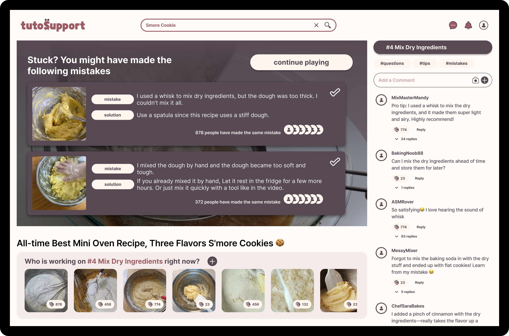
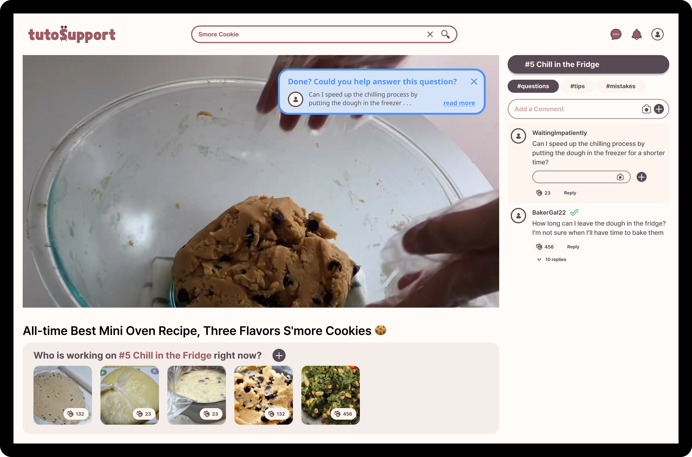
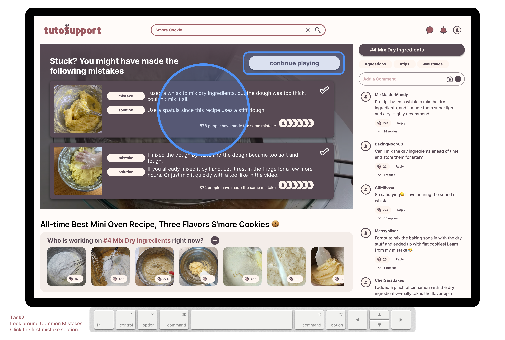
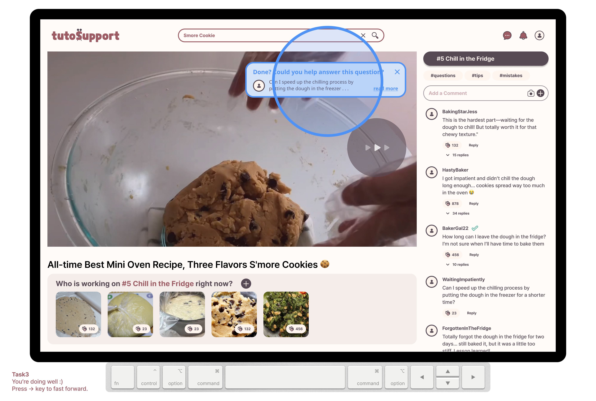

> Team Name : **TutoSupport** Team Members: Hyewon Lee(20200529), Hyun A Kim (20210830), Sheikh Shafayat (20200873)

# **Problem Statement**
---

With a **traditional commenting** system, it’s hard to get **personalized inspiration and feedback** depending on the user’s level and environment while following _video tutorials_ for **hands-on tasks**.

> *Hands-on tasks indicate the activities that require physical manipulation, practice or experience; for example knitting, cooking, baking etc. In this project, we focus on tasks that incorporate creativity.

# **Tasks**
---

1. **Finding inspiration from different users’ works.**
    
    When users start the tutorial, they will see a curated collection of other users’ works before they can move on to the video. _This is core to our solution_ because people engaging in hands-on tasks often rely on community-driven ideas to spark their own creativity; other people’s variations can serve as inspiration for users to enhance their own projects.
    
2. **Recognizing and overcoming mistakes from your work.**
    
    Paused video screens, when hovered, will show a list of common mistakes containing [1] a visual of the “problem output” and [2] solutions for correcting those mistakes. This list comes from the most clapped comments on the current task with `#mistakes` tag. _This is core to our solution_ because it is difficult to recognize mistakes when doing hands-on tasks: everyone’s situation is different and it’s challenging to fully grasp specific circumstances through text alone.
    
3. **Giving other people feedback.**
    
    When users fast-forward, they are often done with their current task; thus, users skipping forward will see a popup on the corner of the video, containing some unanswered question with appropriate difficulty. _This is core to our solution_ because while many experienced members in hands-on tasks are willing to help out (e.g. on Ravelry), asking questions outside of the tutorial’s time-specific context requires more effort from both the person seeking help and the one providing it.
    
4. **Share your work at multiple stages and get encouragement.**
    
    As the video progresses, the user can upload their work in progress; they will also see other people’s works in progress at that stage and be able to cheer them on. _This is core to our solution_ because sharing intermediate results fosters a sense of community and provides emotional support, enabling users to encourage one another and stay motivated to finish their work.
    

# **Prototype**
---

**Link to our prototype:** [link](https://www.figma.com/proto/tN5fqGHkupCzWYTLJYmZgx/CS473?page-id=388:8531&node-id=388-8886&node-type=frame&viewport=640,478,0.09&t=khVGPkaA4VNQZupy-1&scaling=contain&content-scaling=fixed&starting-point-node-id=388:8886)

**TutoSupport** is a social platform for video tutorials on hands-on tasks, designed to help users **easily receive personalized inspiration and feedback** while following the tutorials. **TutoSupport** features a commenting system that supports media attachments, categorization by tutorial step, and tagging (`#tips`, `#questions`, `#mistakes`) by comment type. It also includes a gallery where users can share work-in-progress (WIP) pictures at multiple stages. Users can "clap" for comments or WIPs to express support or empathy. The most "clapped" WIP in the final stage is showcased on the _Hall of Fame_ board, while comments tagged as `#mistake` are featured on the _Common Mistakes_ board. Through this system, users can easily find solutions, receive feedback, and gain both inspiration and encouragement.

## **Design Choices**

Our prototype does not include the following features which are not part of the core interaction:

1. Interactions taking users out of the tutorial are not implemented, since they do not involve the core social tasks in our solution
    
    1. The search box and subscribe button are not implemented
        1. In this prototype, we used a s’more cookie-baking video[(link)](https://www.youtube.com/watch?v=ycVPTDRQglk&t=311s) as an example
    2. The current user’s information is not included in the prototype
        1. Login/logout functionality is not implemented
        2. Profiles can not be visited or modified
        3. The top right three icons on the header don’t work.
2. Commenting functionality is not fully implemented (we use fake comment data)
    
    The commenting system is partially implemented for [Task3], however, the user doesn’t type the comment — it is already provided. The comments provided on the interface were created and rephrased using ChatGPT based on the various comments from YouTube.
    
3. Video interaction is not fully implemented (only supports seek forward and play/pause)
    
    Our prototype uses some part of the video that fits each task, not the full video. In the prototype, we implemented pressing the `→` key on the keyboard to move on to the next video chunk.
    
    Showing common mistakes by Pause is only implemented for [Task2]. Timeline on the video and seeking backward is not implemented. In the final system, users will be able to freely interact with the entire video using a keyboard and mouse.
    

## **Representative Screenshots**

|  |  |
| ---------------------------- | ---------------------------- |
|  |   |

## **Instructions**

The bottom left of the prototype has the guidelines on how to use it. First, click on the second video of the first row to start the prototype.

### **Task 1: Hall of fame**

1. [Upon starting]
    1. You will see a **hall of fame** with the finished products of other users.
    2. Click on the `( clap )` button to cheer on others.
    3. Click on the `( start tutorial )` button to start the tutorial.
2. [After starting tutorial]
    1. Press the `→` key on your real keyboard to move on to the next task

### **Task 2: Recognizing and overcoming mistakes**

1. [Upon pressing `SPACE`]
    1. You will see a **list of common mistakes**
    2. Press on the `( first common mistake )` to see the mistake on your comments area
2. [After moving on]
    1. Press the `→` key on your real keyboard to move on to the next task

### **Task 3: Giving others feedback**

1. [Upon pressing `→`]
    1. You will get a popup of an unanswered question.
    2. Click on the popup to answer the question.
2. [Question gets pinned to the top]
    1. Press `ENTER` key to type your comment.
    2. Click on the `( + )` button to reply.
    3. Press the `→` key on your real keyboard to move on to the next task

### **Task 4: Share your work at multiple stages and get encouragement.**

1. [Moving on to next step] You get a notification that your work-in-process got 500 claps.
2. [You decide to upload a photo of your finished work]
    1. Click on the `( + )` button to share your photo.