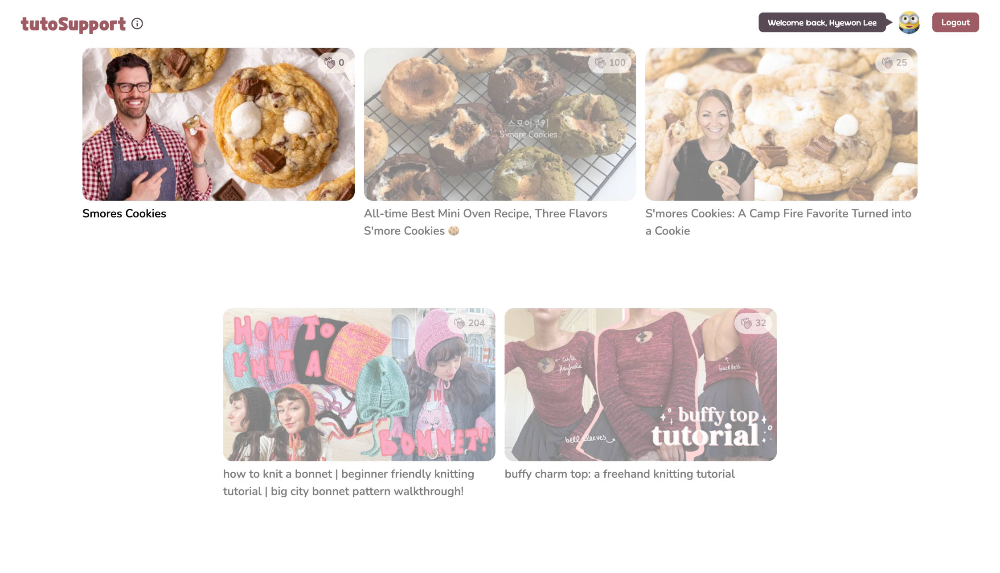
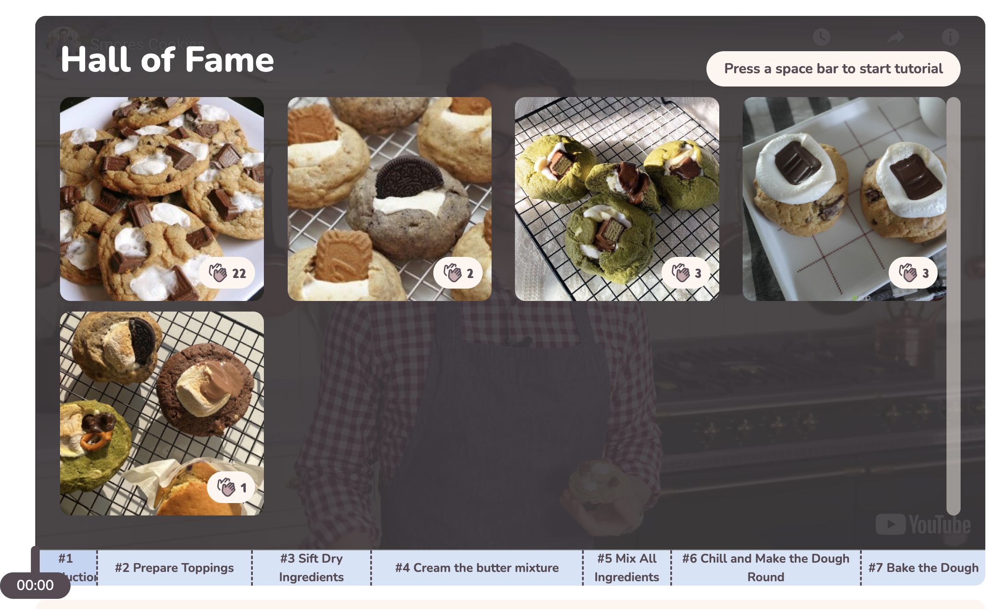
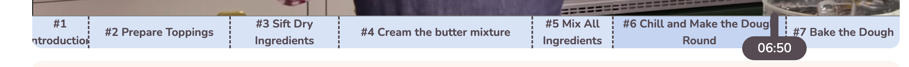
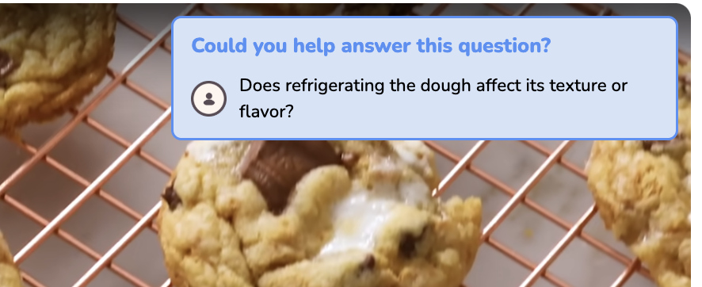
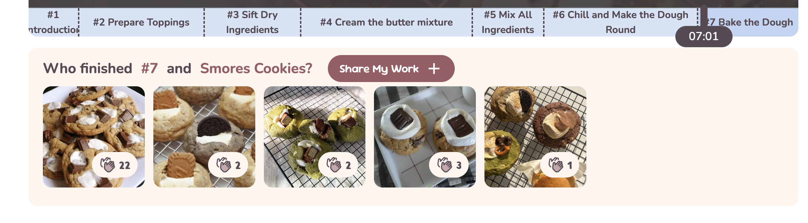

# Studio4

> Team Name : **TutoSupport**
> Team Members: Hyewon Lee(20200529), Hyun A Kim (20210830), Sheikh Shafayat (20200873)

# **Project Summary**

---

[1] With a **traditional commenting** system, it’s hard to get **personalized inspiration and feedback** depending on the user’s level and environment while following _video tutorials_ for **hands-on tasks**.

[2] Our solution, **`TutoSupport`**, is a social system for video tutorials that makes it easier to **receive personalized inspiration and feedback** while following the tutorials — featuring a commenting system, a gallery, and various video interactions — making it easier to get feedback, encouragement, and inspiration.

[3] We seamlessly integrate feedback into video tutorials through **[1] video interactions** like common mistakes displayed upon pause and feedback request alerts during skip-forward actions, **[2] real-time social support** with claps and confetti, and **[3] structured, step-specific information** in comments and gallery images, ensuring inspiration is contextually relevant.

# **Instruction**

---

### 0. Overview of Basic Features

- **Video**
  
  - A **_step-based video timeline_** allows users to skip to specific tutorial steps.
  - The user can drag the slider to move to different parts. The **_handle_** shows the current time.
  - **_Keyboard input_** is supported for interactions:
    - **`spacebar`** - Pause/Replay
    - **`right arrow →`** - Skip forward 5 seconds
    - **`left arrow ←`** - Skip backward 5 seconds
- 💬 **Comments ([4] Common mistakes)**
  - Logged-in users can leave comments for each tutorial step. Comments displayed corresponds to the current tutorial step. Comments can have tags, and you can filter comments based on tags by clicking on the three tags on the top.
    
  - Top comments with the `#mistakes` tag are featured in the **Common mistakes** board, helping users to **_recognize and overcome mistakes_.**
- 🖼️ **Gallery ([3] Hall of fame)**
  - The **Gallery** allows logged-in users to upload work-in-progress photos for each tutorial step. The gallery displayed at the bottom corresponds to the current step in the video. Photos from the final step with the most claps are featured in the **Hall of Fame**, where users can **_easily gain inspiration and insights_** from others' work.
- 🥳 **Encourage Alert**
  - When a user's gallery photo receives claps, they are notified with an encouragement message and confetti effect. This allows the user to gain **_social support_** from others and provides **_motivation_** to complete the tutorial.
- ⁉️ **Feedback Request Alert**
  - When users skip forward to a new section, comments needing feedback from the previous section are recommended. This feature helps users who can provide feedback **_easily notice users who need feedback_**, promoting more active social interaction.

### 1. Entering the Video Page

When you first enter our project, you can see the list of videos from Youtube. Our high-fi prototype only supports the first video, **_Smore Cookies_**([https://www.youtube.com/watch?v=MvPdE27Otig](https://www.youtube.com/watch?v=MvPdE27Otig)).

### 2. Login with Google account

Refer to the screenshots below and make sure you log in properly. You can log in and log out by clicking the brown button in the header, located at the top-right corner.

Header before login

Header after login

### 3. Look through the Hall of Fame board

> core task 1️⃣ **Finding inspiration from different users’ works.**

When entering the video page, the video doesn’t start immediately. Instead, a **Hall of Fame** (visible only at 00:00) is displayed, showcasing the most clapped contributions from the gallery. While browsing others' work, you might **_gain inspiration_** on how to shape the cookie dough!

Press the **`spacebar`** to start the tutorial.

### 4. Pause and Notice the Common Mistakes on step#3

> core task 2️⃣ **Recognizing and overcoming mistakes from your work.**

You might be stuck at some step. Pause the video and hover over it to view common mistakes and solutions.

> ✅ To test this feature, we recommend to pause on the step #3 [Sift Dry Ingredients]

- The top 2 **_most clapped comments_** with the `#mistakes` tag and pinned answers are shown.
- Clicking on a mistake opens the full comment in the right-hand comments section.
- To hide the overlay, move your mouse outside the video screen.

### 5. Get Feedback Request Alert and Leave Feedback on step#6

> core task 3️⃣ **Giving other people feedback.**

You’ve completed step #6 and are moving to step #7 by skipping forward. Press the `right arrow →` key on your keyboard to skip to the next step.

> ✅ To test this feature, we recommend to press the right arrow key on your keyboard at 06:50.

- An alert will appear requesting feedback, showing the **_most recent comment_** tagged with `#questions` and **_no replies_**.
  
- Click the alert to see the full comment and provide some feedback.
- The alert pops up only when you fast-forward to the next step, as it suggests you likely completed the previous step confidently. It disappears after a short time to avoid distracting the user.

### 6. Upload Your Work on step#7

> core task 4️⃣ **Share your work at multiple stages and get encouragement.**

Now you’ve made the cookie successfully! Click the **[Share My Work +]** button at the bottom to upload your cookies to the gallery. Your photo will appear in the gallery below the video.

You can share your work at any step, as each step has its own gallery.

Press the **[clap icon button]** on a photo to encourage others. If your photo receives claps from others, you’ll see a celebratory effect, as shown below.

> ✅ To test this feature in real-time, we recommend opening multiple windows with different Google accounts.

# URL of Prototype

---

[https://tutosupport.vercel.app/](https://tutosupport.vercel.app/)

> ✅ We recommend testing our prototype with a stable internet connection, as images may fail to load with a poor connection. A **keyboard** is required for video interactions, and a **Google account** is needed to access the comments and gallery features.

# URL of Git Repository

---

[https://github.com/hye1ee/TutoSupport](https://github.com/hye1ee/TutoSupport)

# **Libraries and frameworks**

---

### Frameworks

We used [**`React.js`**](https://react.dev/) (along with react-dom for routing) as our base frontend framework and [**`vite`**](https://vite.dev/) (with rollup for bundling) as our build tool. For the backend, we utilized Firestore from [\*\*`Firebase`](https://firebase.google.com/).\*\*

### Libraries

- **`react-confetti`**
  - Used for creating celebratory visual effects with confetti.
- **`react-icons`**
  - Used for rendering all icons.
- **`react-spinners`**
  - Used for implementing a hashtag-shaped spinner when fetching data from the database.
- **`antd`**
  - Used for implementing some UI components such as tags and buttons.
- **`react-player`**
  - Used for fetching videos from YouTube and implementing all video interactions.
- **`styled-components`**
  - Used for styling React components on the main page, video timeline, and galleries.

### Deployment

We deployed the project using **`Vercel`**. For the video, we used **"Smore Cookies"** ([YouTube link](https://www.youtube.com/watch?v=MvPdE27Otig)) from YouTube. Using **`ChatGPT`**, we generated some dummy comment data and manually added additional comments later.

# **Individual Reflections**

---

- **Hyewon Lee**
  I set up the basic structure for the implementation: building the project, setting up layouts and routing, and configuring the deployment pipeline. I implemented the main page, video and its interactions, galleries, encouragement alerts (confetti), and feedback request alerts (comment pop-ups).
  **The most difficult part:**
  I usually worked alone as a full-stack developer in the past, which allowed me to easily debug by adding mock data myself. However, in this project, I had to work on the front-end using a server created by others, which made debugging more challenging. Because of this, it became crucial to implement the required features accurately to minimize the need for debugging.
  **One useful skill:**
  While working as part of a team (especially on the front-end), I focused on making the structure easy to read and understand for everyone. With GPT's help, I feel like I’ve improved my ability to create meaningful and effective function names.
- **Hyun A Kim**
  I implemented the comment section interaction and connection with backend, as well as connecting video overlay elements (common mistakes, alerts) with the comment section.
  **The most difficult part:**
  In previous projects I usually had a lot more time for development. In this project, the backend development time coincided with frontend, which meant that there were frequent updates to align data structures depending on the backend implementation.
  **One useful skill:**
  Since there wasn’t much time available, I made use of design libraries, so I think I learned how to streamline the development process a bit more. Since there were two members on front-end, I also tried to improve the understandability of my code by others.
- **Sheikh Shafayat**
  I implemented the backend using firebase. I have never done backend (or any web) development before so many things were interesting. I got familiar with Typescripts. However, using Firebase makes the whole thing very smooth. I extensively used ChatGPT to write and debug the code.
  **The most difficult part:** I needed to make sure that my API was usable for the front-end people. On several occasions, my API lacked the necessary functionality and I made them after their requests.
  **One useful skill:** Learning to think in high level about system architecture and API design. Hyewon’s diagrams helped me a lot with this.
