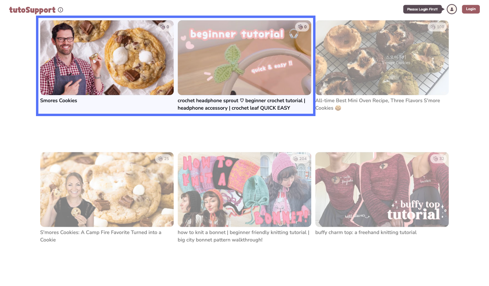
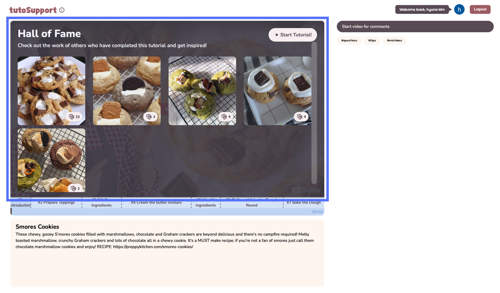
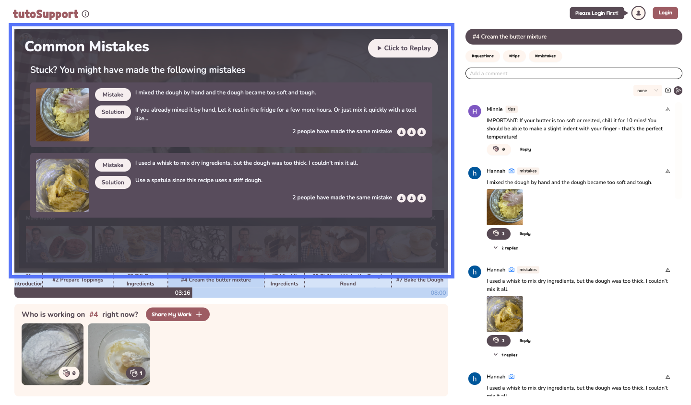
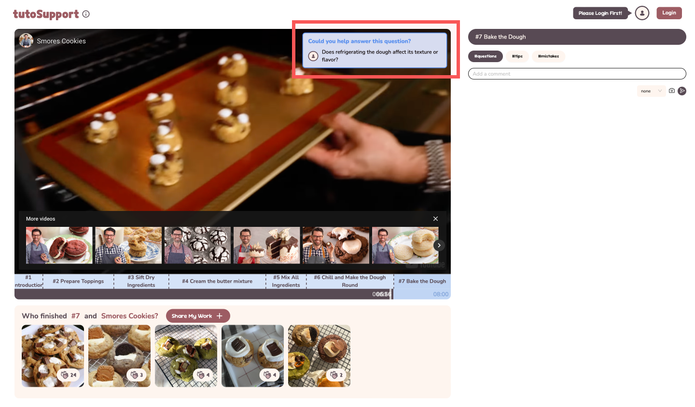
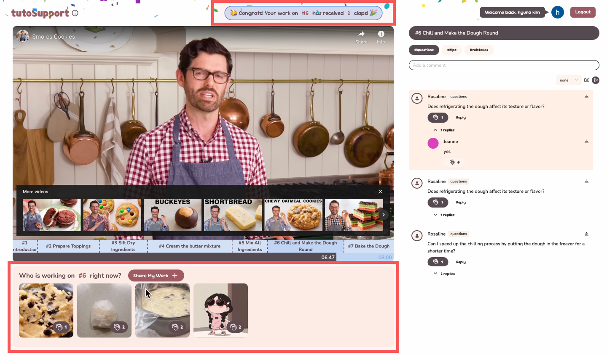
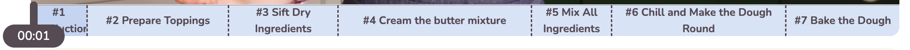
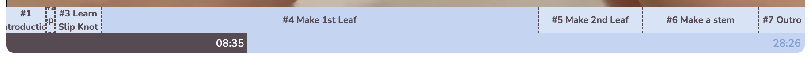
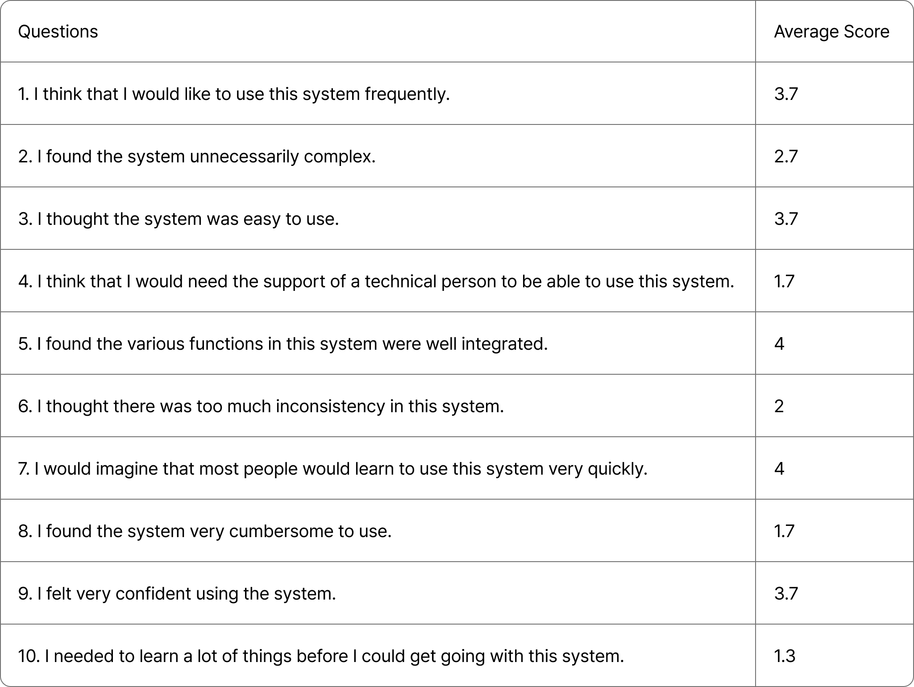

# **TutoSupport**

> Team Name : **TutoSupport**
> Team Members: Hyewon Lee(20200529), Hyun A Kim (20210830), Sheikh Shafayat (20200873)

# **Representative screenshots**

Starting page with two supported videos

| Hall of Fame that shows up when starting video| List of Common Mistakes showcasing mistakes and solutions|
| --------------------------------------------------------------------------------------------------------------------------------------------------------- | ------------------------------------------------------------------------------------------------------------------------------------------------- |
| Feedback-request popup when fast-forwarding near the end of a step| Confetti when others clap on your Gallery uploads|

# **Quality arguments**

**[1] Video Sections**

We designed a custom timeline dividing tutorials into clickable sections, enabling users to skip to specific steps easily, which received positive comments during user testing. After testing, we enhanced the interface to allow skipping to precise times directly from the timeline. 

Previous timeline

New timeline

Each step has a Gallery and comments section for easier navigation and feedback.

**[2] Video Interaction**

We modified video interaction so that feedback is easier to find and give.

**`#1 Hall of Fame`** 

Displays inspiring finished works when users enter the video, so users start the tutorial with various sources of inspiration.

**`#2 Common Mistakes`**

Appears on the video screen when the video is paused, allowing users to naturally learn about potential mistakes while focusing on their own tasks. These disappear when the cursor moves away, giving users the option to watch the video without interruption. A tester quickly found material advice upon pause.

**`#3 Feedback-request popup`**

Prompts users fast-forwarding near the end of a section to provide feedback naturally

**[3] Gallery**

Users uploading progress photos receive **`#4 real-time updates`** when others clap their contributions. This serves as positive feedback, encouraging users to share their work while providing inspiration for others.

During testing, users noted that the Gallery not only provided inspiration but also fostered a sense of encouragement from having others “working alongside” them.

**[4] Comments**

Tagged comments make it easier to find relevant comments or request specific feedback. Tags differentiate the kind of feedback users may want: the `#mistakes` tag is for comments requesting solutions for mistakes.

**[5] Summary**

Our system helps users easily access tailored feedback, inspiration, and emotional support through a visually appealing design.

# **Deployment summary**

### **Study Design**

We conducted an in-lab study with 3 beginner level users (2 female, 1 male). Participants followed a beginner-level crochet tutorial ([https://www.youtube.com/watch?v=jbMKDhgx4eM](https://www.youtube.com/watch?v=jbMKDhgx4eM)) using our system, with all materials provided. During the study, we observed how they completed the core tasks. Afterward, they filled out a **System Usability Scale (SUS)** and participated in a brief interview.

### **Results**

The System Usability Scale (SUS) was individually scored using a 5-point Likert scale ranging from 1 (strongly disagree) to 5 (strongly agree). The final score is graded as follows: 85 and above: Excellent, 70–84: Good, 60–69: OK, below 50: Poor.

The SUS survey rated the system as **"Good" (P1:77.5, P2:70.0, P3:75.0)**, showing it effectively addresses target problems through a social approach but has room for improvement.

All participants responded positively, highlighting the system’s ability to provide tailored feedback, inspiration, and emotional support as its key strengths. 

- **P1**: “The common mistakes and the step-categorized comments helped me find useful comments faster.”
- **P2**: “I like that photos can be added in comments because words aren’t enough for these tasks.”
- **P3**: “The gallery feature created a sense of togetherness, making the experience feel less lonely and more supportive.”

They also offered constructive feedback, highlighting areas for improvement

- **P1**: “I wish there was a way to pin common mistakes so I could read the comments alongside them.”
- **P2**: “With more users (and more comments), the common mistakes would be more helpful. For me, they weren’t very relevant.”
- **P3**: “Lack of moderation led to inconsistent quality in the common mistakes board.”

### **Improvements Based on Feedback**

Based on the feedback, we implemented 6 major improvements to enhance usability, primarily focusing on video interaction. Following are the major improvements:

1. Allow users to directly jump to a specific time (only fast forward was available).
2. Allow users to pause and replay by mouse click (only the space bar was available).
3. Redesigned the comment tagging interface for better clarity.
4. Introduced a reporting feature to manage inappropriate content.

# **Discussion**

### Foundations and Growth: **The Cold Start Problem**

**TutoSupport** is designed to facilitate collaboration, but it relies heavily on solving the cold start problem, where the system becomes more effective as more users engage and contribute useful photos and comments. Unlike other passive video-watching platforms, TutoSupport requires active user participation.

To address this, the system incorporates features to encourage participation: when a user's gallery photo is clapped, a confetti animation celebrates their contribution, motivating further participation; fast-forwarding prompts users to answer unanswered questions, reinforcing collaboration; and after finishing a video, users are encouraged to upload their completed work to inspire others. These design choices aim to overcome the cold start problem by actively fostering and rewarding collaboration.

### **Collaboration**

Hands-on tasks are inherently collaborative, because it is a domain where other people’s lived experiences are the most concrete source of information. TutoSupport aims to improve social translucence in following hands-on task tutorials. 

TutoSupport improves **visibility** by showcasing everyone’s works-in-progress and notifying users upon claps. By introducing tags and images in comments, we increase the common ground users have, making it easier for others to answer queries.

We introduce **social structures** by incorporating video interactions. Only users who are fast-forwarding are prompted with unanswered questions, making it likely that these users are well-versed in the topic.

Thus, we aimed to facilitate meaningful discourse by being mindful of social aspects of design.

### Value

By providing various ways of interacting with the interface, TutoSupport aims to provide value to everyone, from beginners to advanced users. 

An obvious one is **information**, since users can gain inspiration and feedback through various channels. But users can also get a sense of **emotional support** from using TutoSupport. Through the Gallery feature, users can see that other people worked on the same tutorial and show their appreciation through claps. By providing real-time alerts on other people’s claps, TutoSupport tries to further enhance the sense of togetherness.

Because TutoSupport is geared towards education, it is probably not wise to measure its value solely using metrics like engagement. In our user study, we tried to see how well TutoSupport aided learning. 

### **Moderation**

**TutoSupport** currently lacks moderation, operating under the assumption that most users will post helpful comments and relevant photos. However, this assumption does not align with real-world scenarios, as demonstrated during deployment. For example, one user uploaded a random picture to the Gallery in our baking video. Additionally, feedback from P3 highlighted inconsistencies in the quality of comments on the Common Mistakes board.

Currently, **TutoSupport** automatically selects the most clapped comments and photos for display on boards like Common Mistakes and the Hall of Fame. This approach risks amplifying irrelevant or harmful content.

To address these issues, the following strategies can be applied:

1. **User-Driven Moderation**: Implementing downvote or report features to let users flag inappropriate content.
2. **Creator-Based Moderation**: Allowing video creators to manage the quality of content displayed on boards.
3. **Platform-Led Moderation**: Introducing automated or manual moderation to ensure content quality and relevance.

---

# **Individual reflection**

### **Hyewon Lee**

**[1] My Contributions**

I set up the foundational structure for the implementation, including building the project, setting up layouts and routing, and configuring the deployment pipeline. I implemented half of the frontend: the main page, video interactions, galleries, encouragement alerts (confetti), and feedback request alerts (comment pop-ups). Additionally, I scraped comments from a YouTube video and performed the initial screening.

**[2] Teamwork Reflections**

Our team had clearly defined roles, with two members handling the frontend and one working on the backend. Since all team members had strong technical skills and experience, we independently developed our respective parts. However, during the final stages, resolving real-time issues together required significant communication effort due to differences in how each part was implemented (e.g., methods and libraries used). Through this, I learned the importance of staying actively involved and informed about other parts of the project, even if they are outside my immediate responsibilities, to enhance collaboration.

**[3] Lessons learned**

This was my first experience working on a team project in English. Initially, I found it challenging to communicate ideas logically and propose solutions during the ideation stage. However, with weekly meetings, I improved significantly over time. Our team conducted an in-lab user study, and while writing the conclusions, I realized the importance of clearly understanding what a study can and cannot prove. This highlighted the need to define clear objectives and outcomes in advance to ensure the study effectively supports the intended goals.

### **Hyun A Kim**

**[1] My Contributions**

I implemented the comment section and connection with backend, as well as connecting video overlay elements (common mistakes, alerts) with the comment section. I also set up the initial Gallery data and list of users.

**[2] Teamwork Reflections**

We divided tasks cleanly so that everyone could work at the same time. For instance, I could work on the comments section without worrying about other frontend implementation. But I think we would have benefited from having a more concrete plan for data structures from the beginning, because we had to redo some parts due to communication mishaps.

Through this project, I learned that if every member cares enough about the project, it becomes easier to overcome hurdles. In the future, I would ensure that the project itself is compelling to each team member. 

**[3] Lessons learned**

Since there wasn’t much time available, I learned how to streamline the development process. I also tried to improve the understandability of my code by others. 

This was my first project where I did user testing, which allowed me to learn the importance of getting feedback. I realized that I only thought that the system was intuitive because I had been working on it for months; user testing helps clarify where the system is lacking. Also, I realized that our users may have been significantly aided from small onboarding clues like tooltips.

### **Sheikh Shafayat**

**[1] My Contributions**

I made the backend of the web app. The process was easy because we used Firebase (suggested by Hyewon). The coding was mostly done in typescript, and I extensively used ChatGPT as a coding assistant. I also classified the comments on their appropriate timestamps and tags using ChatGPT API and then uploaded them.

**[2] Teamwork Reflections**

The task division in teamwork was clear and specific and I enjoyed working with my teammate, all of whom delivered everything on time. They are hardworking individuals who did their best to have a good outcome for the class project. Moreover, my teammates have a good sense of aesthetics, which tremendously helped in the project.

**[3] Lessons learned**

Primary lesson:

- Good designs are critical for developing social interaction
- User study is important to finding blind spots that we otherwise miss. For example, the user I was interviewing pointed out some very trivial issues with the interface which I had overlooked before because I got so used to using the interface as it was.
- Low-fi prototype is very crucial to get a sense of the design. Previously I used to believe in “just build it” principle, but now I know that I was wrong. Making a low-fi prototype makes the final product much easier to make and saves time.
- Figma is a useful tool that I should consider using more extensively. My teammates use Figma even for making slides, which I didn’t even know was possible.

Things I would do differently:

- If I could go back in time, I would actually do the project on a different, perhaps more interesting and relatable, topic. For example, I personally consider the Pizza.js team’s donation app idea to be more relevant and interesting to a broader range of students.
